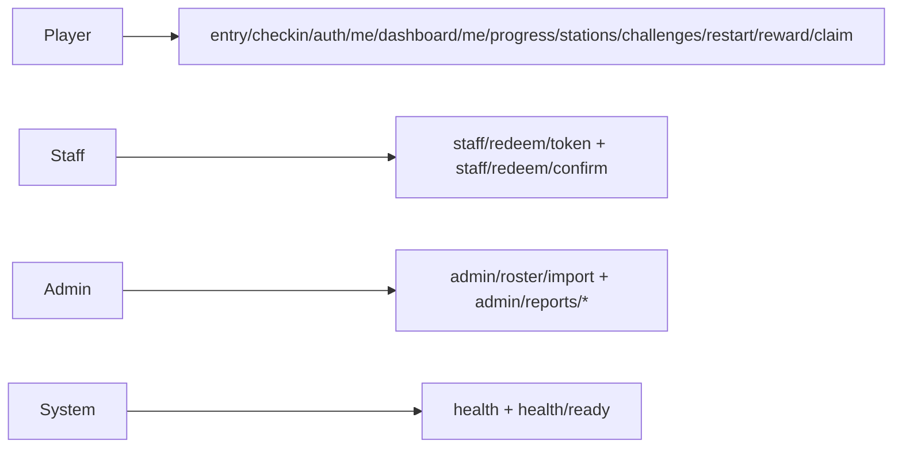

# 瑞軒 2026 家庭日 — 解謎闖關遊戲（綠世界生態農場）

<p align="center">
  
</p>

## 目錄

- [快速開始](#快速開始)
- [專案概覽](#專案概覽)
- [Demo 影片預覽](#demo-影片預覽)
- [技術架構](#技術架構)
- [規格與活動內容](#規格與活動內容)
- [使用者流程](#使用者流程)
- [設計資產與會議](#設計資產與會議)
- [待辦與進度](#待辦與進度)
- [儲存庫目錄結構](#儲存庫目錄結構)
- [文件與維護](#文件與維護)

---

## 快速開始

### 30 秒本機啟動（前端）

需求：Node.js 20+。

```bash
cd familyday-frontend
npm install
npm run dev
```

預設開啟 `http://localhost:5173`（實際埠號以 [`fdgw.project.json`](fdgw.project.json) 為準）。

### 30 秒 Windows 一鍵啟動（前端 + API + 雲端 Firestore）

```powershell
.\scripts\dev-oneclick.ps1 -CredentialPath "D:\path\to\your-sa.json"
```

### 三個核心入口

- 專案主文件：[`docs/project/project-master.md`](docs/project/project-master.md)
- Setup 索引：[`docs/setup/README.md`](docs/setup/README.md)
- API 契約：[`familyday-api-contract/api-v0.1.md`](familyday-api-contract/api-v0.1.md)

### Windows：30 秒啟動（前端 + API + 雲端 Firestore）

在倉庫根目錄執行：

```powershell
.\scripts\dev-oneclick.ps1 -CredentialPath "D:\path\to\your-sa.json"
```

細節（環境變數、`seed/purge`、Rules、故障排除）請看：
- [`docs/setup/local-firestore-gcp.md`](docs/setup/local-firestore-gcp.md)
- [`docs/setup/README.md`](docs/setup/README.md)

<a id="gcp-service-account-local-firestore"></a>

### 設定單一來源（必對齊）

- Firebase 與產品常數：[`familyday-backend/fdgw.project.json`](familyday-backend/fdgw.project.json)
- Firebase CLI 目標專案：[`familyday-backend/.firebaserc`](familyday-backend/.firebaserc)
- 整合測試主清單：[`docs/testing/api-integration-checklist.md`](docs/testing/api-integration-checklist.md)
- 金鑰 JSON **不可提交 Git**

### 上線包含／不包含（避免混淆）

| 類別 | 路徑／檔案 | 是否進正式上線執行 | 說明 |
|------|------------|--------------------|------|
| 前端執行碼 | `familyday-frontend/src/**`、`familyday-frontend/public/**` | 會（經 build 後） | 由 `npm run build` 打包成 `familyday-frontend/dist`，提供正式站點執行 |
| 部署產物 | `familyday-frontend/dist/**` | 會（部署時使用） | 最終上線的靜態資源輸出 |
| 單元測試 | `familyday-frontend/src/**/*.test.ts` | 不會 | 僅供本機與 CI 驗證行為；不打包進 production |
| Mock API | `familyday-frontend/mock/**` | 不會（正式環境） | 僅開發／驗證用；正式環境應改接實際後端 |
| CI 設定 | `.github/workflows/*.yml` | 不會（runtime） | 只在 GitHub Actions 執行測試、建置與部署流程 |
| 開發依賴 | `familyday-frontend/node_modules/**` | 不會（runtime） | 建置與開發工具依賴，非部署產物 |

### 目前實際進度（即時狀態）

| 面向 | 現況 |
|------|------|
| 前端 | `familyday-frontend/` 可本機啟動、建置與預覽；已可透過 `VITE_API_BASE` 串接 Firebase Functions |
| API | `familyday-backend/` Cloud Functions 已落地核心與 Phase 2 端點（`health/auth/checkin/dashboard/me/progress/stations/challenges/restart/reward/claim/staff/admin`） |
| 後端資料層 | 已完成 in-memory + Firestore toggle（`FDGW_USE_FIRESTORE`）；Firestore 最終實證目前卡在 IAM 權限 |
| 測試 | Vitest 單元測試與 CI 持續通過；4/30 已完成 Functions 聯調與 CORS allowlist 驗證 |
| 部署 | 可進行 dev/stage 驗證上架；正式對外上線仍需先完成 IAM 與最小安全基線 |

### Windows：Node.js／npm 問題

見 [`docs/setup/nodejs-windows.md`](docs/setup/nodejs-windows.md)。

<a id="preview-netlify-test-ui"></a>

### 公開預覽部署（測試 Web UI）

見 [`docs/setup/static-preview-netlify-github.md`](docs/setup/static-preview-netlify-github.md)。

<a id="ui-preview-screenshots"></a>

### 介面預覽（截圖）

以下為 **`familyday-frontend/` 生產建置**（`npm run build`）後，以 **390×844**（常見手機寬度）全頁截圖；與 [Netlify 測試站](#preview-netlify-test-ui)／本機 `npm run preview` **同一套輸出**。原始檔置於 [`docs/preview/screenshots/`](docs/preview/screenshots/)（重新產生步驟見 [`docs/media/README.md`](docs/media/README.md)）。

| 歡迎 `/` | 報到 `/checkin` |
| :---: | :---: |
| [](docs/preview/screenshots/preview-welcome.png) | [](docs/preview/screenshots/preview-checkin-form.png) |
| 闖關登入 `/register` | 闖關地圖 `/stage` |
| [](docs/preview/screenshots/preview-register.png) | [](docs/preview/screenshots/preview-stage.png) |

**領取成功**（`/finish/claimed`）— [](docs/preview/screenshots/preview-claim-success.png)

---

## 專案概覽

### 專案簡介

| 項目     | 說明                                                                                                        |
| ------ | --------------------------------------------------------------------------------------------------------- |
| 活動     | 新竹北埔**綠世界生態農場**；對象為**台北辦公室同仁及眷屬**（預估約 **1,000～1,300** 人）；活動日**確認中**（偏好**六月底**，或七月初）                       |
| 產品     | 解謎 Web 應用；同仁與家人體驗生態探索，完成關卡可至指定地點領取紀念品                                                                     |
| 提案／線框 PDF | `docs/proposals/FamilyDayApp_Proposal_v1.pdf`（v1，2026.04.10）、[`FamilyDayApp_wireframe_v2.pdf`](docs/proposals/FamilyDayApp_wireframe_v2.pdf)（線框 v2）；靜態圖另見 [`docs/design/wireframe/`](docs/design/wireframe/) |
| 需求主文件  | `docs/project/project-master.md`（合併版：需求、待確認、狀態、技術）；索引見 `docs/README.md`                                             |
| 資訊開發人員 | Ken、Brian                                                                                                 |
| GitHub | [BrianChang1212/FamilyDay_GreenWorld](https://github.com/BrianChang1212/FamilyDay_GreenWorld)             |

### 文件來源與紀要

| 項目          | 內容                                                                                                                    |
| ----------- | --------------------------------------------------------------------------------------------------------------------- |
| 需求筆記        | 已結構化寫入 `docs/project/` 等（細節見 `docs/project/project-master.md`）                                                                               |
| 文件體系        | 詳見 [`docs/README.md`](docs/README.md)（分類索引）→ `docs/project/project-master.md`                                                                  |
| 最後更新 README | 2026-05-05（頁尾 **v2.56**）；`project-master` **v1.3.33**；細節見 [`docs/media/README.md`](docs/media/README.md)、[`docs/project/project-master.md`](docs/project/project-master.md)、[`docs/setup/README.md`](docs/setup/README.md) |

---

## Demo 影片預覽

內嵌播放與檔名、GitHub／本機預覽注意事項見 **[`docs/media/README.md`](docs/media/README.md)**。若下列路徑無檔案，請改點後援連結。

<video src="docs/demo/family-day-prototype-demo.mp4" controls playsinline width="100%" style="max-width:720px;border-radius:8px"></video>

**後援：** [family-day-prototype-demo.mp4](./docs/demo/family-day-prototype-demo.mp4) · [docs/demo](./docs/demo/)

---

## 技術架構

| 層級 | 重點 |
| --- | --- |
| 前端 | Vue 3 + Vite + TypeScript + Tailwind + Vue Router（`familyday-frontend/`） |
| 後端 | Firebase（Firestore 為主，Realtime Database 視場景啟用） |
| API 契約 | `familyday-api-contract/api-v0.1.md` |
| 架構摘要 | 前端：`docs/architecture/summary-frontend.md`、後端：`docs/architecture/summary-backend.md`、部署：`docs/architecture/summary-deployment.md`、流量：`docs/architecture/summary-traffic.md` |

### API 觸發時機（簡短版）



- Player：使用者在報到、闖關、作答、再玩一輪時觸發。
- Staff：櫃台核銷與領獎確認時觸發。
- Admin：名冊匯入與營運報表查詢時觸發。
- System：監控與部署健康檢查時觸發。
- 完整版（含分群詳圖與端點表）：`docs/specs/api-v0.1.md` §12。

### 快速路由（原型）

- 報到入口：`/check-in` -> `/checkin` -> `/checkin/complete`
- 闖關入口：`/game` -> `/` -> `/register` -> `/stage`
- 領獎頁：`/finish`、`/finish/claimed`

完整流程圖與資料流請看 `docs/project/project-master.md`（需求與流程、技術規格）及 `docs/architecture/summary-frontend.md`。

---

## 規格與活動內容

| 項目 | 摘要 |
| --- | --- |
| 活動規模 | 約 1,000～1,300 人 |
| 核心功能 | 現場報到 + 闖關遊戲（同一 Web App、不同路由） |
| 報名規則 | 1+3 免費，第 5 人起加收 |
| 闖關規則 | 6 關，答錯可重答，同工號最多 3 次/3 份 |

完整規格與時程請看 `docs/project/project-master.md`。

---

## 使用者流程

- 報到：掃報到 QR -> 報到單頁 -> 完成頁（不自動進闖關）
- 闖關：掃闖關入口 QR -> 歡迎/說明 -> 登入 -> 地圖/關卡（**六站完成順序不拘**）-> 完成領獎
- 各關到站：掃現場關卡 QR 驗證

完整分流與畫面順序請看 `docs/project/project-master.md` 與 `docs/architecture/summary-frontend.md`。

---

## 設計資產與會議

**待取得（Action：@Fendy Wei／魏淑芬）**

1. 活動主視覺（Key Visual）— 目標 **4/17 前**確認
2. 企業識別：**Logo、印花圖樣、CIS** 等

**會議**

- 預計 **每週五 10:00** 開會（**A1 會議室**；以行事曆為準）。

**線框（靜態）** — [`docs/design/wireframe/`](docs/design/wireframe/)（畫面操作錄影見上節 [Demo 影片預覽](#demo-影片預覽)）。

---

## 待辦與進度

### 待確認（高優先級節錄）

完整清單見 `docs/project/project-master.md`。會議後仍待主辦／表單補齊者例如：

1. 活動**確切日期**（六月底 vs 七月初）
2. 事前報名**表單欄位明細**、收費規則說明、保險文案
3. 簽到 QR 與闖關入口之**導覽與資安**（專屬 QR 發放方式）
4. 報名清冊與現場簽到／闖關後端之**資料切分與同步**

### 技術選型（草案已完成，待會議簽核）

細節見 `docs/project/project-master.md`（開頭補充文件表）及 `docs/architecture/summary-*.md`。

1. **前端（草案簽核中；實作現況見上表）：** Vue 3 + Vite + TypeScript + Tailwind + Vue Router；**Naive UI** 可選、尚未納入 `package.json`
2. **Database（定案）：** Firebase（Firestore 為主，Realtime Database 視場景啟用）
3. **RWD：** 需要（手機優先）
4. **Sheet：** 匯入／匯出與同步時機（仍待確認）
5. **部署：** Firebase 專案與 Blaze 預算告警（見 `docs/architecture/summary-deployment.md`）

### 專案進度（概覽）

整體約 **62%**（前端可操作 + Functions API 已落地 + 4/30 聯調驗證 + CORS allowlist 收斂；阻塞點為 Firestore IAM 權限，尚未完成最終實證與正式上線安全項）。細項見 `docs/project/project-master.md`「專案狀態」。

| 項目 | 狀態 |
| ---------------- | --------------------------------------- |
| 需求收集與整理 | 完成 |
| 技術選型 | Cloud Functions + Firestore 路線已落地實作；正式維運參數待簽核 |
| UI/UX 設計（設計稿／KV） | 進行中（功能流程先行，正式視覺資產持續補齊） |
| 開發 | **前端 + API + 後端（in-memory）** 已完成主要流程；Firestore 模式程式路徑已打通，待 IAM 權限完成最終驗證 |
| 測試 | **前端** Vitest + CI 持續通過；**後端聯調**已完成健康檢查、登入、報到、闖關、staff/admin、401/409 與 CORS 驗證 |
| 部署 | **dev/stage 可驗證上架**；正式上線需先完成 Firestore IAM、憑證與安全基線（HTTPS/Cookie/權限） |

### 下一步（本週）

**高優先級**

- 完成**目標 Firebase 專案**（與 [`fdgw.project.json`](fdgw.project.json) 的 `firebaseProjectId`、金鑰 JSON 內 `project_id`、 [`.firebaserc`](.firebaserc) 一致）的 Firestore IAM 授權（至少 Cloud Datastore User）  
- 確認本機驗證身分已對齊目標專案（`firebase login:list` 需有授權帳號；`GOOGLE_CLOUD_PROJECT=<同上專案 ID>`）  
- 重跑 `familyday-backend/` 的 `npm run verify:firestore` 並保存證據（CLI 輸出 + Firestore 查驗）  
- 將 Firestore 驗證結果回填 `docs/testing/api-integration-checklist.md`（解除 Blocked）  
- 確認 `VITE_API_BASE`、CORS allowlist 與目標驗證網域一致  

**中優先級**

- 補齊 Firestore Security Rules 檢核與最小監控告警清單  
- 將 dev/stage 驗證流程整理為可重跑的 runbook（含憑證與環境變數）  

---

## 儲存庫目錄結構

| 路徑                | 用途                                                                                                                |
| ----------------- | ----------------------------------------------------------------------------------------------------------------- |
| `docs/`           | 見 [`docs/README.md`](docs/README.md)（含 **`setup/`** 本機與預覽、`project/`、`specs/`、`architecture/`、`media/` 等） |
| `assets/`         | 設計稿、KV、Logo、CIS（註明版本與來源）                                                                                          |
| `familyday-frontend/` | 前端獨立 repo（Vue 3 + Vite + TS + Tailwind + Vue Router）：`npm install` → `npm run dev`；`npm run test`（Vitest） |
| `familyday-backend/` | 後端獨立 repo（Firebase Functions + Firestore 設定）：`npm install` → `npm run build` / `npm run serve` |
| `familyday-api-contract/` | API 契約獨立 repo（`api-v0.1.md` + 契約治理檔） |
| `source/`         | 舊版前端目錄（legacy，僅保留歷史追溯） |
| `functions/`      | 舊版後端目錄（legacy，僅保留歷史追溯） |
| `.claude/skills/`（全域） | Agent skills 由全域管理；本專案不需額外內嵌 skills（非執行期依賴） |
| `test/`           | 倉庫根目錄**驗收／測試紀錄**用（**選用**；目前僅 **`.gitkeep`**）。**程式單元測試**在 **`familyday-frontend/src/**/*.test.ts`**（Vitest），非此資料夾 |
| `tool/`           | 輔助腳本（**選用**）：例如 [`tool/capture-preview-screenshots.ps1`](tool/capture-preview-screenshots.ps1)（重產 [`docs/preview/screenshots/`](docs/preview/screenshots/)，見 [`docs/media/README.md`](docs/media/README.md)）；另含 **`.gitkeep`** |

---

## 文件與維護

| 你想… | 請開 |
| ----- | --- |
| 5 分鐘掌握專案 | 本 README |
| 本機 GCP／Firestore、靜態預覽、Windows Node | [`docs/setup/README.md`](docs/setup/README.md) |
| 完整需求、待辦、進度、技術 | [`docs/project/project-master.md`](docs/project/project-master.md) |
| Repo 拆分遷移說明 | [`docs/project/repo-split-migration.md`](docs/project/repo-split-migration.md) |
| 文件分類索引 | [`docs/README.md`](docs/README.md) |
| API 契約（v0.1） | [`familyday-api-contract/api-v0.1.md`](familyday-api-contract/api-v0.1.md) |
| 前後端／部署／流量摘要 | [`docs/architecture/summary-frontend.md`](docs/architecture/summary-frontend.md) 等 |
| Demo 錄影與截圖維護 | [`docs/media/README.md`](docs/media/README.md) |

| 文件 | 建議更新時機 |
| --- | --- |
| `README.md` | 重大變更、里程碑 |
| `docs/project/project-master.md` | 需求／技術／會議／進度任一變更時 |
| `docs/setup/**` | 本機指令、預覽網址、腳本參數變更時 |

---

*README v2.56 · 2026-05-05（快速開始：`fdgw` 埠號註記；版本鏈：`api-v0.1` **v0.1.21**、`summary-frontend` **v1.31**、`summary-deployment` **v1.6**、`summary-backend` **v1.6**、`summary-traffic` **v1.2**；前版 v2.55）*
