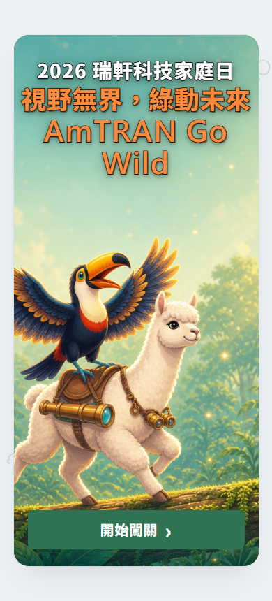
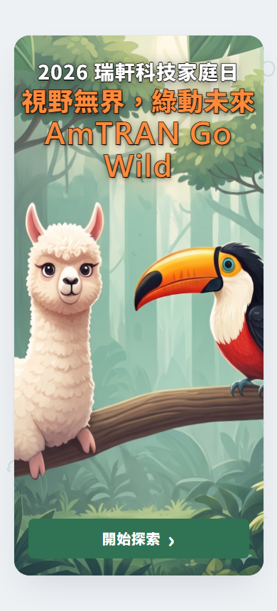
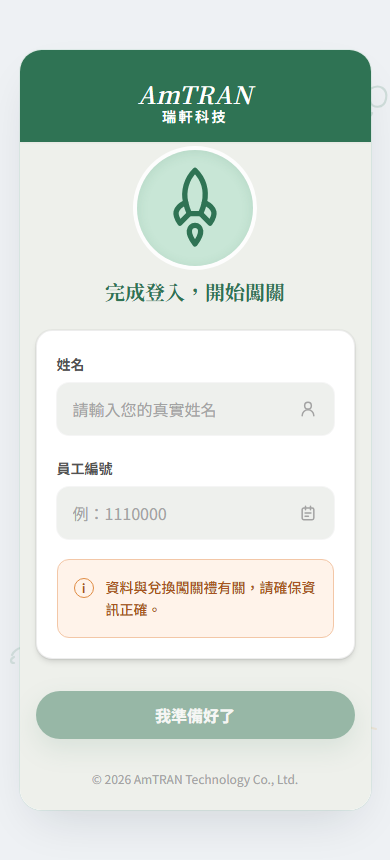
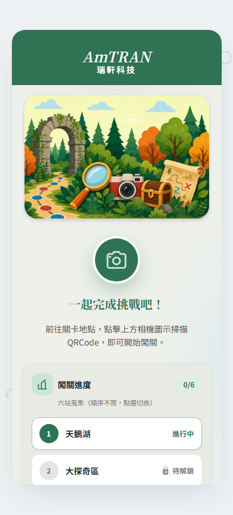
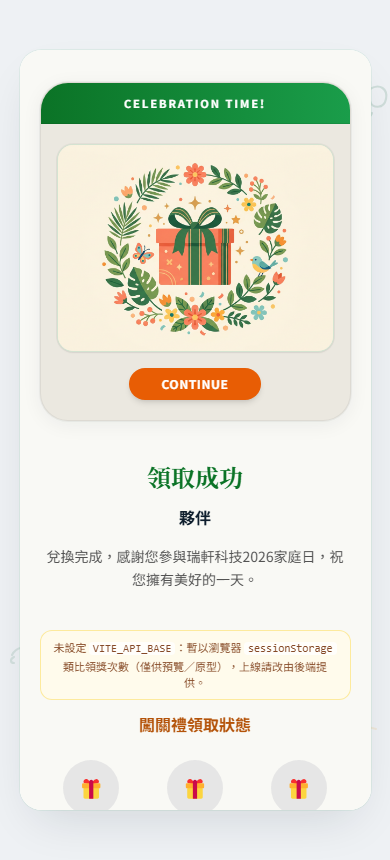
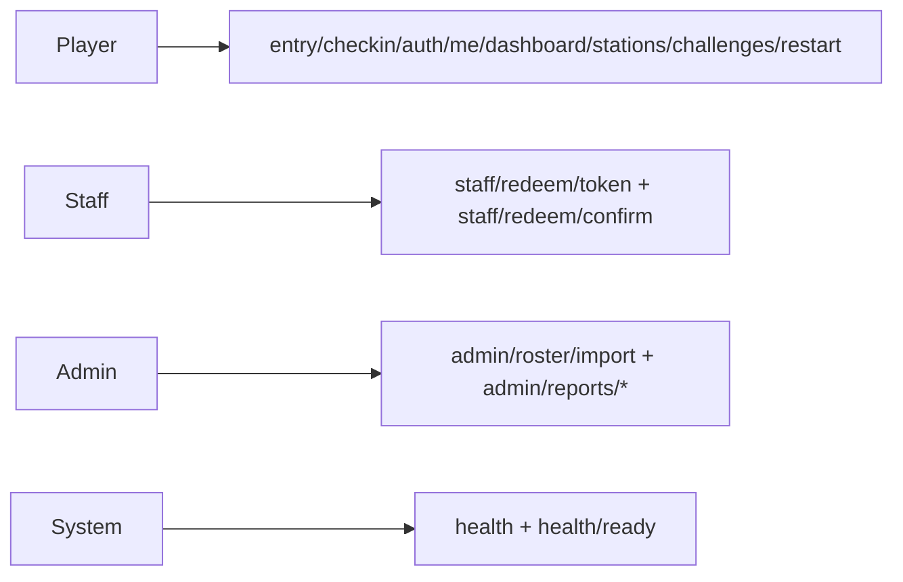

# 瑞軒 2026 家庭日 — 解謎闖關遊戲（綠世界生態農場）

<p align="center">
  
</p>

## 目錄

- [快速開始](#快速開始)
  - [介面預覽（截圖）](#ui-preview-screenshots)
- [專案概覽](#專案概覽)
- [Demo 影片預覽](#demo-影片預覽)
- [技術架構](#技術架構)
  - [系統架構圖](#系統架構圖)
- [規格與活動內容](#規格與活動內容)
- [使用者流程](#使用者流程)
- [設計資產與會議](#設計資產與會議)
- [待辦與進度](#待辦與進度)
- [儲存庫目錄結構](#儲存庫目錄結構)
- [文件與維護](#文件與維護)

---

## 快速開始

### 取得程式庫

```bash
git clone https://github.com/BrianChang1212/FamilyDay_GreenWorld.git
cd FamilyDay_GreenWorld
```

（若本機路徑為 `20260410_FamilyDay_GreenWorld_App`，與上列為同一專案內容時，可略過 clone，直接在該資料夾操作。）

### 只讀文件／規格

1. 開啟 `[docs/README.md](docs/README.md)` 了解 `docs/` 分類。
2. 完整需求與會議基線：`[docs/project/project-master.md](docs/project/project-master.md)`。
3. API 與架構摘要：`docs/specs/`、`docs/architecture/`（見上列索引）。

### Windows：安裝 Node.js 與 npm（winget）

若 PowerShell 出現 **npm** 無法辨識，代表尚未安裝 Node.js，或 PATH 尚未載入。

**1. 以 winget 安裝（建議：無系統管理員權限時用「使用者範圍」）**

全系統安裝（預設）在**非系統管理員**環境可能失敗（MSI **Error 1925**／結束代碼 **1603**：權限不足）。可改為只安裝給目前使用者：

```powershell
winget install OpenJS.NodeJS.LTS --accept-package-agreements --accept-source-agreements --disable-interactivity --scope user
```

成功時 winget 會提示已新增 `node` 指令，並可能提示**需重新開啟終端機**才會套用 PATH。

**2. 同一個終端機內立即套用 PATH（不必重開 Cursor 時可先執行）**

```powershell
$env:Path = [System.Environment]::GetEnvironmentVariable("Path","User") + ";" + [System.Environment]::GetEnvironmentVariable("Path","Machine")
node -v
npm -v
```

**3. 安裝專案相依套件（在 `source/`）**

```powershell
cd source
npm install
```

（若上一步已執行過 `npm install`，可略過。本機曾驗證：**Node v24.14.1**、**npm 11.x**。）

**4. 全系統安裝（選用）**

若要以**系統管理員**安裝給所有使用者：以系統管理員開啟 PowerShell，執行 `winget install OpenJS.NodeJS.LTS ...`（**不要**加 `--scope user`），並依 UAC 提示同意。

**5. 安裝失敗時的記錄檔（winget／MSI）**

路徑範例（實際檔名含時間戳記）：

`%LOCALAPPDATA%\Packages\Microsoft.DesktopAppInstaller_8wekyb3d8bbwe\LocalState\DiagOutputDir\`

內可搜尋 **Error 1925**、**1603** 對照權限或舊版衝突。

---

### 本機執行前端原型（`source/`）

**需求：** [Node.js](https://nodejs.org/) **20 LTS 或以上**皆可；本倉庫曾以 **winget LTS 套件（例如 v24.x）** 驗證。須能執行 `node`、`npm`。

```bash
cd source
npm install
npm run dev
```

（`npm install` 與上一節 Windows 步驟重複時，擇一執行即可。）

瀏覽器開啟終端機顯示之本機網址（Vite 預設多為 **[http://localhost:5173](http://localhost:5173)**）。  
建置預覽：`npm run build` 後 `npm run preview`。

**單元測試（Vitest）：** 於 `source/` 執行 `npm run test`；開發監看可用 `npm run test:watch`；覆蓋率報告可用 `npm run test:coverage`。測試檔與程式並列（`source/src/**/*.test.ts`）。GitHub Actions [`.github/workflows/ci.yml`](.github/workflows/ci.yml) 在 `npm run build` **之前**會先跑 `npm run test`。

**說明：** 後端 API 尚未串接時，多數畫面仍以 mock／靜態流程為主。**未設定 `VITE_API_BASE` 時**，完成頁領獎次數會以瀏覽器 `sessionStorage` 類比（僅供預覽）；若要以**真實後端**顯示次數，請於 `source/` 建立 `.env.local`（或建置環境變數）設定 **`VITE_API_BASE`**（API 主機根、無尾隨 `/`），詳見 `docs/architecture/summary-frontend.md` §4。定案見 `docs/specs/api-v0.1.md` 與 `docs/architecture/summary-backend.md`。

<a id="preview-netlify-test-ui"></a>

### 公開預覽部署 · 測試 Web UI

> 給他人用手機／瀏覽器試操作，可不接後端；與 [`docs/architecture/summary-deployment.md`](docs/architecture/summary-deployment.md) **§1.1**（修訂 **v1.5**）、[`docs/architecture/summary-frontend.md`](docs/architecture/summary-frontend.md) **§4** 互相連結。

靜態檔來自 `source/` 的 `npm run build` 產物（`source/dist`）。**建議優先使用 Netlify**（子路徑與 Vue Router 較省事）；亦可使用本倉庫內建的 GitHub Actions 發布至 GitHub Pages。

> **用途標記 · 測試 Web UI 操作**  
> 下表 **Netlify 網址**與 **QR 用連結**僅供 **測試介面與流程**（內部／利害關係人預覽）。**非**正式活動對外定案之網域或 SLA；正式上線請改用公司核可的網域、後端與資安設定。若於 Netlify **變更站名或自訂網域**，請同步更新本段與實體 QR 內嵌網址。

#### 測試 Web UI：Netlify 預覽站（與 GitHub 連動）

| 項目 | 說明 |
|------|------|
| **預覽網址（範例）** | **[https://familyday-greenworld.netlify.app](https://familyday-greenworld.netlify.app)** — 以 Netlify **Domain management** 顯示為準 |
| **自動更新** | 站台已 **Connect to Git** 時，對 **`main`**（或綁定分支）**push** 且建置成功後，線上 UI 即為新版；失敗時仍為上一版 **Published** |
| **首次匯入注意** | 設定畫面須填 **Base directory：`source`**（與 [`netlify.toml`](netlify.toml) 一致）；**Publish directory：`dist`**；**勿**設 `VITE_BASE_PATH`（站點在網域根目錄） |
| **存續** | 站點未刪除、帳號與方案有效時，網址通常**持續可用**；免費方案有建置分鐘／流量等額度，見 [Netlify 方案說明](https://www.netlify.com/pricing/) |

**報到／闖關分流（同一預覽站、不同路徑 — 印靜態 QR 時請含完整 `https`）**

| 用途 | 測試用連結（範例網域同上；若更換請只替換主機名） |
|------|------|
| 報到 | `https://familyday-greenworld.netlify.app/check-in` |
| 闖關 | `https://familyday-greenworld.netlify.app/game` |

**QR 產生器（靜態碼，內容＝上列網址即可）：** 例如 [MakeQRCode](https://makeqrcode.app/)、[The Free QR Code Generator](https://the-free-qrcode-generator.com/)、需 Logo／印刷輸出時 [QRCode Monkey](https://www.qrcode-monkey.com/)。列印建議錯誤修正 **Q 或 H**，印出前務必實掃確認。

**方式 A：Netlify（建議）**

1. 登入 [Netlify](https://www.netlify.com/)，**Add new site → Import an existing project**，授權並選取本 GitHub 儲存庫。  
2. 建置設定由 [`netlify.toml`](netlify.toml) 帶入；若 UI 未帶出，手動確認 **Base directory = `source`**、`npm run build`、**Publish directory = `dist`**，並已設定 SPA 導向（子路徑重新整理可開）。  
3. 部署完成後將 **`https://…netlify.app`** 傳給預覽者。**勿設定 `VITE_BASE_PATH`**（`vite.config` 預設 `base: '/'`）。

**方式 B：GitHub Pages**

1. 將變更推上 GitHub 預設分支（如 `main`）。  
2. 儲存庫 **Settings → Pages**：**Build and deployment** 的 **Source** 選 **GitHub Actions**（首次需儲存設定）。  
3. 工作流程：[`.github/workflows/deploy-github-pages.yml`](.github/workflows/deploy-github-pages.yml) 會在 `source/` 內建置，並設定 `VITE_BASE_PATH=/<repo名稱>/`，產物並複製 `index.html` 為 `404.html` 以利 SPA。  
4. 至 **Actions** 手動執行 **Deploy GitHub Pages**（`workflow_dispatch`）；**勿**在未完成 Pages 設定前強求每次 push 自動部署（避免檢查顯示失敗）。例行 push 僅執行建置驗證：[`ci.yml`](.github/workflows/ci.yml)。  
5. 網址形如：`https://<你的帳號>.github.io/<repo名稱>/`（以實際帳號／倉庫名為準）。

**同區網快速試機（不經 Netlify／GitHub）**

在 `source/` 執行 `npm run dev -- --host`，以手機與電腦連同一 Wi‑Fi，手機瀏覽器開 `http://<電腦區網IP>:5173`（防火牆需允許該連接埠）。

<a id="ui-preview-screenshots"></a>

### 介面預覽（截圖）

以下為 **`source/` 生產建置**（`npm run build`）後，以 **390×844**（常見手機寬度）全頁截圖；與 [Netlify 測試站](#preview-netlify-test-ui)／本機 `npm run preview` **同一套輸出**。原始檔置於 [`docs/preview/screenshots/`](docs/preview/screenshots/)（重新產生步驟見 [`docs/media/README.md`](docs/media/README.md)）。

| 歡迎 `/` | 報到 `/checkin` |
| :---: | :---: |
| [](docs/preview/screenshots/preview-welcome.png) | [](docs/preview/screenshots/preview-checkin-form.png) |
| 闖關登入 `/register` | 闖關地圖 `/stage` |
| [](docs/preview/screenshots/preview-register.png) | [](docs/preview/screenshots/preview-stage.png) |

**領取成功**（`/finish/claimed`）— [](docs/preview/screenshots/preview-claim-success.png)

---

## 專案概覽

### 專案簡介


| 項目     | 說明                                                                                                        |
| ------ | --------------------------------------------------------------------------------------------------------- |
| 活動     | 新竹北埔**綠世界生態農場**；對象為**台北辦公室同仁及眷屬**（預估約 **1,000～1,300** 人）；活動日**確認中**（偏好**六月底**，或七月初）                       |
| 產品     | 解謎 Web 應用；同仁與家人體驗生態探索，完成關卡可至指定地點領取紀念品                                                                     |
| 提案／線框 PDF | `docs/proposals/FamilyDayApp_Proposal_v1.pdf`（v1，2026.04.10）、[`FamilyDayApp_wireframe_v2.pdf`](docs/proposals/FamilyDayApp_wireframe_v2.pdf)（線框 v2）；靜態圖另見 [`docs/design/wireframe/`](docs/design/wireframe/) |
| 需求主文件  | `docs/project/project-master.md`（合併版：需求、待確認、狀態、技術）；索引見 `docs/README.md`                                             |
| 資訊開發人員 | Ken、Brian                                                                                                 |
| GitHub | [BrianChang1212/FamilyDay_GreenWorld](https://github.com/BrianChang1212/FamilyDay_GreenWorld)             |


### 文件來源與紀要


| 項目          | 內容                                                                                                                    |
| ----------- | --------------------------------------------------------------------------------------------------------------------- |
| 需求筆記        | `d:\Brian\闖關遊戲,txt.ini`（已結構化寫入 `docs/`）                                                                               |
| 文件體系        | 詳見 `docs/README.md`（分類索引）→ `docs/project/project-master.md`；`docs/proposals/`、`docs/design/` 等                                  |
| 最後更新 README | 2026-04-28（頁尾 **v2.52**）；細節見 [`docs/media/README.md`](docs/media/README.md)、[`docs/project/project-master.md`](docs/project/project-master.md)（合併版 **v1.3.29**；`summary-frontend` **v1.26**：版本鏈同步） |


---

## Demo 影片預覽

內嵌播放與檔名、GitHub／本機預覽注意事項見 **[`docs/media/README.md`](docs/media/README.md)**。若下列路徑無檔案，請改點後援連結。

<video src="docs/demo/family-day-prototype-demo.mp4" controls playsinline width="100%" style="max-width:720px;border-radius:8px"></video>

**後援：** [family-day-prototype-demo.mp4](./docs/demo/family-day-prototype-demo.mp4) · [docs/demo](./docs/demo/)

---

## 技術架構

| 層級 | 重點 |
| --- | --- |
| 前端 | Vue 3 + Vite + TypeScript + Tailwind + Vue Router（`source/`） |
| 後端 | Firebase（Firestore 為主，Realtime Database 視場景啟用） |
| API 契約 | `docs/specs/api-v0.1.md` |
| 架構摘要 | 前端：`docs/architecture/summary-frontend.md`、後端：`docs/architecture/summary-backend.md`、部署：`docs/architecture/summary-deployment.md`、流量：`docs/architecture/summary-traffic.md` |

### API 觸發時機（簡短版）



- Player：使用者在報到、闖關、作答、再玩一輪時觸發。
- Staff：櫃台核銷與領獎確認時觸發。
- Admin：名冊匯入與營運報表查詢時觸發。
- System：監控與部署健康檢查時觸發。
- 完整版（含分群詳圖與端點表）：`docs/specs/api-v0.1.md` §12。

### 快速路由（原型）

- 報到入口：`/check-in` -> `/checkin` -> `/checkin/complete`
- 闖關入口：`/game` -> `/` -> `/register` -> `/stage`
- 領獎頁：`/finish`、`/finish/claimed`

完整流程圖與資料流請看 `docs/project/project-master.md`（需求與流程、技術規格）及 `docs/architecture/summary-frontend.md`。

---

## 規格與活動內容

| 項目 | 摘要 |
| --- | --- |
| 活動規模 | 約 1,000～1,300 人 |
| 核心功能 | 現場報到 + 闖關遊戲（同一 Web App、不同路由） |
| 報名規則 | 1+3 免費，第 5 人起加收 |
| 闖關規則 | 6 關，答錯可重答，同工號最多 3 次/3 份 |

完整規格與時程請看 `docs/project/project-master.md`。

---

## 使用者流程

- 報到：掃報到 QR -> 報到單頁 -> 完成頁（不自動進闖關）
- 闖關：掃闖關入口 QR -> 歡迎/說明 -> 登入 -> 地圖/關卡 -> 完成領獎
- 各關到站：掃現場關卡 QR 驗證

完整分流與畫面順序請看 `docs/project/project-master.md` 與 `docs/architecture/summary-frontend.md`。

---

## 設計資產與會議

**待取得（Action：@Fendy Wei／魏淑芬）**

1. 活動主視覺（Key Visual）— 目標 **4/17 前**確認
2. 企業識別：**Logo、印花圖樣、CIS** 等

**會議**

- 預計 **每週五 10:00** 開會（**A1 會議室**；以行事曆為準）。

**線框（靜態）** — [`docs/design/wireframe/`](docs/design/wireframe/)（畫面操作錄影見上節 [Demo 影片預覽](#demo-影片預覽)）。

---

## 待辦與進度

### 待確認（高優先級節錄）

完整清單見 `docs/project/project-master.md`。會議後仍待主辦／表單補齊者例如：

1. 活動**確切日期**（六月底 vs 七月初）
2. 事前報名**表單欄位明細**、收費規則說明、保險文案
3. 簽到 QR 與闖關入口之**導覽與資安**（專屬 QR 發放方式）
4. 報名清冊與現場簽到／闖關後端之**資料切分與同步**

### 技術選型（草案已完成，待會議簽核）

細節見 `docs/project/project-master.md`（開頭補充文件表）及 `docs/architecture/summary-*.md`。

1. **前端（草案簽核中；實作現況見上表）：** Vue 3 + Vite + TypeScript + Tailwind + Vue Router；**Naive UI** 可選、尚未納入 `package.json`
2. **Database（定案）：** Firebase（Firestore 為主，Realtime Database 視場景啟用）
3. **RWD：** 需要（手機優先）
4. **Sheet：** 匯入／匯出與同步時機（仍待確認）
5. **部署：** Firebase 專案與 Blaze 預算告警（見 `docs/architecture/summary-deployment.md`）

### 專案進度（概覽）

整體約 **24%**（文件＋前端可跑原型＋**前端 Vitest 單元測試與 CI**；後端、整合／E2E／壓測仍待）。細項見 `docs/project/project-master.md`「專案狀態」。


| 項目               | 狀態                                      |
| ---------------- | --------------------------------------- |
| 需求收集與整理          | 完成                                      |
| 技術選型             | 草案完成，待簽核                                |
| UI/UX 設計（設計稿／KV） | 未開始                                     |
| 開發               | **前端** `source/` 可建置與預覽（示範流程）；後端 API 未接 |
| 測試               | **前端** Vitest 單元測試已納入 CI（`source/src/**/*.test.ts`）；整合／E2E／壓測仍待 |
| 部署               | **正式／公司核可場域**尚未定案與上線；**靜態預覽**（Netlify／GitHub Pages 等）見 [公開預覽部署 · 測試 Web UI](#preview-netlify-test-ui) 與 **CI**（[`.github/workflows/ci.yml`](.github/workflows/ci.yml)） |


### 下一步（本週）

**高優先級**

- 需求確認會議（每週五 10:00、A1）  
- 收斂上述高優先級待確認事項  
- 請 Fendy（魏淑芬）提供識別元素（Logo、印花、CIS）；**KV 目標 4/17 前**  
- **4/24 前**收斂流程、App 介面與提示文案（搭配雙週會）

**中優先級**

- 會議**簽核**技術草案（`docs/specs/api-v0.1.md`、`docs/architecture/summary-*.md`）  
- 前端：`source/` 已初始化並可 `npm run dev`／`npm run build`（後端環境仍待簽核後建立）

---

## 儲存庫目錄結構


| 路徑                | 用途                                                                                                                |
| ----------------- | ----------------------------------------------------------------------------------------------------------------- |
| `docs/`           | 見 [`docs/README.md`](docs/README.md)（含 `project/`、`specs/`、`architecture/`、`media/`、`demo/`、`preview/` 等子目錄說明） |
| `assets/`         | 設計稿、KV、Logo、CIS（註明版本與來源）                                                                                          |
| `source/`         | 前端（Vue 3 + Vite + TS + Tailwind + Vue Router）：`npm install` → `npm run dev`（預設 `http://localhost:5173`）；**`npm run test`**（Vitest）。路由頁面於 **`src/views/home`**、**`onboarding`**、**`auth`**、**`checkin`**、**`quest`** |
| `.cursor/skills/` | Cursor Agent 用技能說明（前端設計、文案／在地化等）；選用，**非**執行期依賴                                                                    |
| `test/`           | 倉庫根目錄**驗收／測試紀錄**用（**選用**；目前僅 **`.gitkeep`**）。**程式單元測試**在 **`source/src/**/*.test.ts`**（Vitest），非此資料夾 |
| `tool/`           | 輔助腳本（**選用**）：例如 [`tool/capture-preview-screenshots.ps1`](tool/capture-preview-screenshots.ps1)（重產 [`docs/preview/screenshots/`](docs/preview/screenshots/)，見 [`docs/media/README.md`](docs/media/README.md)）；另含 **`.gitkeep`** |
| `graphify-out/`   | 圖譜／分析工具輸出（HTML／JSON／報告）；**已列於 `.gitignore`**，避免大量快取進版控                                                                 |


---

## 文件與維護

### 重要文件


| 類別           | 檔案                                                               |
| ------------ | ---------------------------------------------------------------- |
| 總覽           | `README.md`（本文件）                                                 |
| 文件索引         | `docs/README.md`（`docs/` 分類導覽）                                   |
| 詳細規格（單檔）     | `docs/project/project-master.md`（需求、待確認、專案狀態、技術規格、提案來源、維護附錄）               |
| API 草案（v0.1） | `docs/specs/api-v0.1.md`（REST 端點、範例 JSON、畫面對照；修訂紀錄見檔尾） |
| 前端討論總結       | `docs/architecture/summary-frontend.md`（Vue3／Vite／模組與 UX、API 銜接） |
| 後端討論總結       | `docs/architecture/summary-backend.md`（Firebase、資料模型與安全規則） |
| 架設環境討論總結     | `docs/architecture/summary-deployment.md`（雲／內網／PaaS、區域與採購注意）     |
| 流量分析討論總結     | `docs/architecture/summary-traffic.md`（在線與 RPS、尖峰、限流、壓測）         |
| 提案／線框 PDF   | `docs/proposals/FamilyDayApp_Proposal_v1.pdf`、`FamilyDayApp_wireframe_v2.pdf` |
| 設計資產說明       | `assets/README.md`                                               |
| 操作示範錄影與截圖維護 | [`docs/media/README.md`](docs/media/README.md)（內嵌播放見本 README [Demo 影片預覽](#demo-影片預覽)） |


### 快速查找


| 你想…           | 請開                               |
| ------------- | -------------------------------- |
| 5 分鐘掌握專案      | 本 README                         |
| 系統架構與資料流圖     | 本 README [技術架構](#技術架構)（在 [Demo 影片預覽](#demo-影片預覽) 之後） |
| 完整需求、待辦、進度、技術 | `docs/project/project-master.md`（內有章節目錄）   |
| 前後端與部署／流量定案摘要 | `docs/architecture/summary-*.md` |
| 畫面操作 Demo       | 本頁 [Demo 影片預覽](#demo-影片預覽)／[`docs/media/README.md`](docs/media/README.md) |


### 建議閱讀順序（角色）


| 角色    | 順序                                                 |
| ----- | -------------------------------------------------- |
| PM    | README → `docs/project/project-master.md`（先「專案狀態」「待確認」再「需求」） |
| 開發    | README → `docs/project/project-master.md`（先「技術規格」再「需求」）      |
| UI/UX | README → `docs/project/project-master.md`（「需求與流程」「待確認」）      |
| 測試    | README → `docs/project/project-master.md`（「需求」「技術規格」）        |


### 文件更新頻率（建議）


| 文件                     | 時機                                             |
| ---------------------- | ---------------------------------------------- |
| `README.md`            | 重大變更、里程碑                                       |
| `docs/project/project-master.md` | 需求／技術／會議／進度任一變更時（更新對應章節）；新路徑見 `docs/README.md` |


---

*README v2.52 · 2026-04-28（版本鏈同步：`summary-frontend` **v1.26**、`summary-backend` **v1.5**、`summary-deployment` **v1.5**、`summary-traffic` **v1.2**；前版 v2.51）*