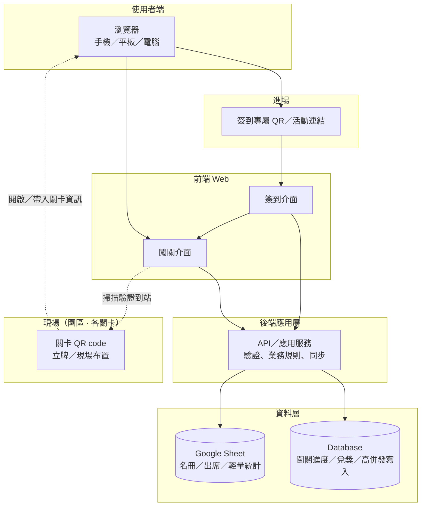
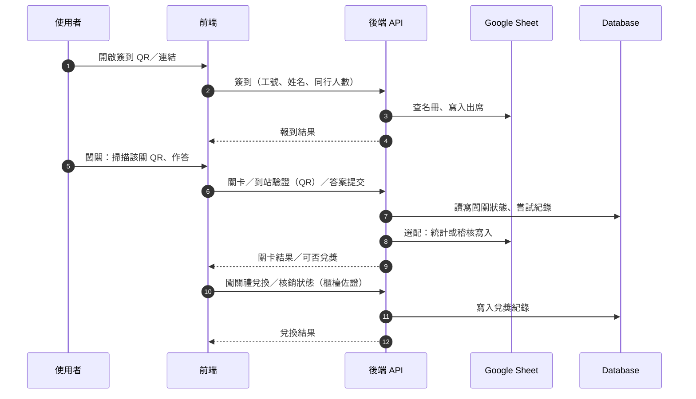

# 瑞軒 2026 家庭日 — 解謎 App（綠世界生態農場）

## 目錄

- [專案概覽](#專案概覽)
- [技術架構](#技術架構)
  - [系統架構圖](#系統架構圖)
- [規格與活動內容](#規格與活動內容)
- [使用者流程](#使用者流程)
- [設計資產與會議](#設計資產與會議)
- [待辦與進度](#待辦與進度)
- [儲存庫目錄結構](#儲存庫目錄結構)
- [文件與維護](#文件與維護)

---

## 專案概覽

### 專案簡介

| 項目 | 說明 |
|------|------|
| 活動 | 新竹北埔**綠世界生態農場**；對象為**台北辦公室同仁及眷屬**（預估約 **1,000～1,300** 人）；活動日**確認中**（偏好**六月底**，或七月初） |
| 產品 | 解謎 Web 應用；同仁與家人體驗生態探索，完成關卡可至指定地點領取紀念品 |
| 提案 PDF | `docs/proposals/FamilyDayApp_Proposal_v1.pdf`（v1，2026.04.10；另可能見 `d:\Brian\FamilyDayApp_Proposal_v1.pdf`） |
| 需求主文件 | `docs/project/專案文件.md`（合併版：需求、待確認、狀態、技術）；索引見 `docs/README.md` |
| 資訊開發人員 | Ken、Brian |
| GitHub | [BrianChang1212/FamilyDay_GreenWorld](https://github.com/BrianChang1212/FamilyDay_GreenWorld) |

### 文件來源與紀要

| 項目 | 內容 |
|------|------|
| 需求筆記 | `d:\Brian\闖關遊戲,txt.ini`（已結構化寫入 `docs/`） |
| 文件體系 | 詳見 `docs/README.md`（分類索引）→ `docs/project/專案文件.md`；`docs/proposals/`、`docs/design/` 等 |
| 最後更新 README | 2026-04-15（Brian）；補齊 **實作現況**（`source/` 前端原型、技術棧與進度表）；0410 會議結論仍為需求基線 |

---

## 技術架構

| 層級 | 內容 |
|------|------|
| 前端 | Web UI；**已實作原型**：Vue 3 + Vite + TypeScript + Tailwind CSS + Vue Router（`source/`）；字體：Noto Sans TC／Noto Serif TC。**Naive UI** 仍為草案選項，**尚未**安裝；表單與版面以 Tailwind 自製為主；RWD |
| 後端 | **草案**：**FastAPI** + **PostgreSQL**（即時資料）；**Sheet** 輔助匯入／匯出（見 `docs/architecture/summary-backend.md`） |
| 效能 | 約 1,300 人活動規模；**在線≠固定 RPS**；壓測見 `docs/architecture/summary-traffic.md` |

### 系統架構圖

以下為**邏輯架構**（實作可為自建 API、Serverless 或 Google Apps Script Web App 等，依 `docs/project/專案文件.md`「技術規格」定案）。**各關到站**以**現場關卡 QR code** 掃描由後端驗證（QR 內容須避免可被輕易偽造或重播；細節於技術規格定案）。

**主要資料流（摘要）**

---

## 規格與活動內容

### 已確認規格（摘要）

| 項目 | 規格 |
|------|------|
| 預估人流 | 約 1,000～1,300 人 |
| 範圍 | **本專案核心**：現場簽到 Web + 闖關遊戲 Web；**事前報名**預計用 Google 表單／企業維信表單（產出報名清冊 Excel，詳見 `docs/project/專案文件.md`） |
| 平台 | Web UI（手機、平板、電腦瀏覽器） |
| 後端 | **草案**：**PostgreSQL** 扛即時簽到／闖關；**Google Sheet** 以報名清冊匯入／報表為主（見 `docs/architecture/summary-backend.md`） |
| 介面 | **簽到頁** + **闖關頁**（兩個獨立頁面） |
| 關卡 | 園內 **6 關**；到站掃**實體 QR**；題型建議**三選一**或圈選題（簡單有趣） |
| 名額／費用（報名） | **1+3**（員工 + 3 名眷屬）免費；**第 5 人起**須額外收費（標準見表單規則） |
| 闖關／獎項 | 一個工號**最多參加 3 次**，最多領 **3 份闖關紀念品**；完成六關後至**大草皮櫃檯**由工作人員驗證畫面領獎；**獎品限量、先到先選** |

### 六大闖關地點（主題區）

會議舉例：**水鳥區、天鵝湖**等六大主題區（與園區實地 QR 布點以**5 月下旬場勘**後定案）。先前提案亦曾列：大探奇區、水生植物公園、鳥園、蝴蝶園、生物多樣性探索區等，**以上併列供對照，以場勘與主辦最終配置為準**。

### 執行階段（摘要）

| 階段 | 內容 | 狀態 |
|------|------|:----:|
| 流程與內容規劃 | 流程架構、UX、闖關機制 | 進行中 |
| UI 設計 | Wireframe／主視覺（KV、CIS）與設計稿交付 | 待開始（**程式碼級介面**已在 `source/` 迭代） |
| 開發與測試 | 前後端、多裝置測試、兌獎與驗收 | 前端原型進行中；後端與 E2E 待開始 |

### 時程（0410 會議＋提案對照）

- **活動舉辦日**：確認中（偏好**六月底**，或**七月初**）；舊提案曾寫 5 月底前**完成開發**，仍以**活動日前驗收**為準。
- **主視覺**：目標 **4/17 前**確認，供設計素材。
- **流程／介面／文案**：**4/24 前**定案；並以**雙週會**追蹤進度。
- **實地場勘**：預計 **5 月下旬**綠世界場勘（關卡 QR 與動線）。

---

## 使用者流程

### 事前報名（表單；非本 Web 專案本體）

- 平台：Google 表單或企業維信表單；產出報名清冊（如 Excel）。  
- 收集：工號、姓名、參加人數、**每位參加者**身分證字號與出生年月日（**保險**所需）、交通（是否搭遊覽車）、午餐桌次等。  
- 名額：**1+3** 免費；**第 5 人起**加收（表單須載明規則與收費標準）。  

### 現場簽到

1. 掃描**活動／專屬 QR code** 進入簽到頁  
2. 輸入**工號、姓名**，並**確認同行人數**（後端比對報名清冊；寫入出席紀錄）  
3. **目的**：作為**補休假**核發憑證之一；並與**餐飲／門票**等預約數據核對  
4. 依**報名人數**領取第一份**報到禮**  
5. 進入闖關介面（流程細節可再定）  

### 闖關

**啟動**：掃描**站點 QR** 或連結進入遊戲。  
**記名**：登入頁綁定**工號 + 姓名**（防止非公司訪客惡意操作）。  
**流程**：六關均於園內**實體 QR** 到站後答題（取代 GPS，減少誤差）→ 完成六關 → 至**大草皮櫃檯**由工作人員**驗證畫面**後領**闖關禮**。  

**規則（0410 會議）**

- 題型：建議**三選一**或圈選題；**答錯可立即重答，直到答對為止**（鼓勵參與）。  
- 同一**工號**最多參加 **3 次**（眷屬分頭闖關或同人重複玩皆可），最多領 **3 份**闖關紀念品。  
- **獎項**：種類**限量**，採**先到先選**制。  

---

## 設計資產與會議

**待取得（Action：@Fendy Wei／魏淑芬）**

1. 活動主視覺（Key Visual）— 目標 **4/17 前**確認  
2. 企業識別：**Logo、印花圖樣、CIS** 等  

**會議**

- 預計 **每週五 10:00** 開會（**A1 會議室**；以行事曆為準）。

---

## 待辦與進度

### 待確認（高優先級節錄）

完整清單見 `docs/project/專案文件.md`。會議後仍待主辦／表單補齊者例如：

1. 活動**確切日期**（六月底 vs 七月初）  
2. 事前報名**表單欄位明細**、收費規則說明、保險文案  
3. 簽到 QR 與闖關入口之**導覽與資安**（專屬 QR 發放方式）  
4. 報名清冊與現場簽到／闖關後端之**資料切分與同步**  

### 技術選型（草案已完成，待會議簽核）

細節見 `docs/project/專案文件.md`（開頭補充文件表）及 `docs/architecture/summary-*.md`。

1. **前端（草案簽核中；實作現況見上表）：** Vue 3 + Vite + TypeScript + Tailwind + Vue Router；**Naive UI** 可選、尚未納入 `package.json`  
2. **Database（草案）：** PostgreSQL  
3. **RWD：** 需要（手機優先）  
4. **Sheet：** 匯入／匯出與同步時機（仍待確認）  
5. **部署：** PaaS／Neon+Cloud Run／公司 DMZ 等（見 `docs/architecture/summary-deployment.md`）  

### 專案進度（概覽）

整體約 **22%**（文件＋前端可跑原型；後端與正式測試尚未）。細項見 `docs/project/專案文件.md`「專案狀態」。

| 項目 | 狀態 |
|------|------|
| 需求收集與整理 | 完成 |
| 技術選型 | 草案完成，待簽核 |
| UI/UX 設計（設計稿／KV） | 未開始 |
| 開發 | **前端** `source/` 可建置與預覽（示範流程）；後端 API 未接 |
| 測試 | 未開始 |
| 部署 | 未開始 |

### 下一步（本週）

**高優先級**

- [ ] 需求確認會議（每週五 10:00、A1）  
- [ ] 收斂上述高優先級待確認事項  
- [ ] 請 Fendy（魏淑芬）提供識別元素（Logo、印花、CIS）；**KV 目標 4/17 前**  
- [ ] **4/24 前**收斂流程、App 介面與提示文案（搭配雙週會）  

**中優先級**

- [ ] 會議**簽核**技術草案（`docs/specs/api-v0.1.md`、`docs/architecture/summary-*.md`）  
- [x] 前端：`source/` 已初始化並可 `npm run dev`／`npm run build`（後端環境仍待簽核後建立）  

---

## 儲存庫目錄結構

| 路徑 | 用途 |
|------|------|
| `docs/` | 見 [`docs/README.md`](docs/README.md)；`project/` 主文件、`specs/` API、`architecture/` 摘要、`proposals/` PDF、`design/` 線框 |
| `assets/` | 設計稿、KV、Logo、CIS（註明版本與來源） |
| `source/` | 前端（Vue 3 + Vite + TS + Tailwind + Vue Router）：於此目錄執行 `npm install` → `npm run dev`（預設 `http://localhost:5173`） |
| `.cursor/skills/` | Cursor Agent 用技能說明（前端設計、文案／在地化等）；選用，**非**執行期依賴 |
| `test/` | 測試與驗收紀錄 |
| `tool/` | 建置、部署、一次性腳本 |

---

## 文件與維護

### 重要文件

| 類別 | 檔案 |
|------|------|
| 總覽 | `README.md`（本文件） |
| 文件索引 | `docs/README.md`（`docs/` 分類導覽） |
| 詳細規格（單檔） | `docs/project/專案文件.md`（需求、待確認、專案狀態、技術規格、提案來源、維護附錄） |
| API 草案（v0.1） | `docs/specs/api-v0.1.md`（REST 端點、範例 JSON、畫面對照） |
| 前端討論總結 | `docs/architecture/summary-frontend.md`（Vue3／Vite／模組與 UX、API 銜接） |
| 後端討論總結 | `docs/architecture/summary-backend.md`（FastAPI／PostgreSQL、模型與安全） |
| 架設環境討論總結 | `docs/architecture/summary-deployment.md`（雲／內網／PaaS、區域與採購注意） |
| 流量分析討論總結 | `docs/architecture/summary-traffic.md`（在線與 RPS、尖峰、限流、壓測） |
| 提案 PDF | `docs/proposals/FamilyDayApp_Proposal_v1.pdf` |
| 設計資產說明 | `assets/README.md` |

### 快速查找

| 你想… | 請開 |
|--------|------|
| 5 分鐘掌握專案 | 本 README |
| 系統架構與資料流圖 | 本 README [技術架構](#技術架構)（緊接專案概覽之後） |
| 完整需求、待辦、進度、技術 | `docs/project/專案文件.md`（內有章節目錄） |
| 前後端與部署／流量定案摘要 | `docs/architecture/summary-*.md` |

### 建議閱讀順序（角色）

| 角色 | 順序 |
|------|------|
| PM | README → `docs/project/專案文件.md`（先「專案狀態」「待確認」再「需求」） |
| 開發 | README → `docs/project/專案文件.md`（先「技術規格」再「需求」） |
| UI/UX | README → `docs/project/專案文件.md`（「需求與流程」「待確認」） |
| 測試 | README → `docs/project/專案文件.md`（「需求」「技術規格」） |

### 文件更新頻率（建議）

| 文件 | 時機 |
|------|------|
| `README.md` | 重大變更、里程碑 |
| `docs/project/專案文件.md` | 需求／技術／會議／進度任一變更時（更新對應章節）；新路徑見 `docs/README.md` |

---

*README v2.1 · 2026-04-15（對齊實作與 0410 需求基線）*
