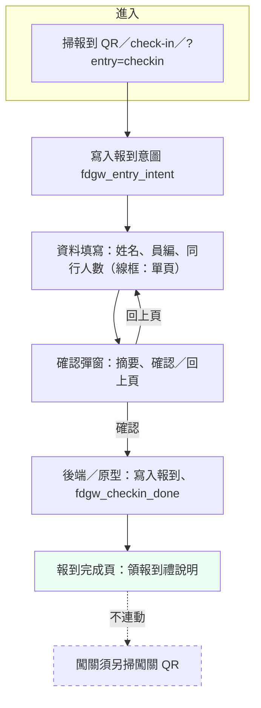
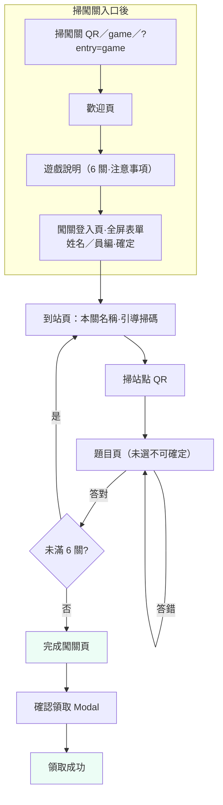

# 前端技術與設計 — 討論總結

> 本文件彙整專案關於**前端架構、介面方向、與 API 銜接**之討論結論，作為後續實作與評審依據。  
> 相關 API 細節見 [`api-v0.1.md`](../specs/api-v0.1.md)（修訂紀錄見該檔文末；§11 **Vitest** 客戶端測試註記，**不重**定義 REST）。

---

## 1. 技術棧（定案方向）

| 項目 | 選型 |
|------|------|
| 框架 | **Vue 3** |
| 建置 | **Vite** |
| 語言 | **TypeScript** |
| 樣式 | **Tailwind CSS**（或 UnoCSS） |
| 元件 | **草案：** **Naive UI** 或表單自製。**實作（2026-04）：** `source/` 以 **Tailwind 自製** 為主，**尚未**加入 Naive UI；字體為 **Noto Sans TC**（內文）＋ **Noto Serif TC**（標題層級） |

**未採用整站 Next.js 的理由（討論結論）**：活動站以 CSR、QR 進入為主，SEO 需求低；**Vite SPA + 後端 API** 較輕、部署單純。若未來要 SSR 再評估 Nuxt／Next。

### 1.1 自動化測試（實作 · 2026-04）

- **執行器：** **Vitest**（`source/vitest.config.ts`），環境 **happy-dom**（`sessionStorage` 等）。  
- **檔案配置：** 與原始碼並列，**`source/src/**/*.test.ts`**（例：`api/rewardClaimStatus.test.ts`、`lib/rewardClaimPresentation.test.ts`、`composables/useRewardClaimPresentation.test.ts`）。  
- **涵蓋範圍（現況）：** `apiBase`、`fetchRewardClaimStatus`／dashboard 映射、`rewardClaimPresentation`、`demoState`、`entryIntent`、`provisionalFinishClaim`、`useRewardClaimPresentation` 等；**未**含各 `.vue` 畫面之完整 E2E。  
- **指令：** `source/` 內 **`npm run test`**（單次）、**`npm run test:watch`**、**`npm run test:coverage`**。  
- **CI：** [`.github/workflows/ci.yml`](../../.github/workflows/ci.yml) 對 **`main`** 之 push／PR：**`npm ci` → `npm run test` → `npm run build`**。

---

## 2. 模組化目錄建議

依功能切分，與線框（歡迎／地圖／報到／園內導覽與闖關）對齊，例如：

- `features/checkin` — 簽到流程（**建議**目錄切分；`source/` 目前以 **`views/`** 子資料夾對齊路由：**`home/`**、**`onboarding/`**、**`auth/`**、**`checkin/`**、**`quest/`**）  
- `features/quest` — 闖關、答題、站點 QR  
- `features/map` 或 `zones` — 關卡瀏覽／地圖  
- `components` — 共用元件（例：全站裝飾 **`components/doodles/PageCritters.vue`**）  
- **`api/`** — **僅** HTTP 與回應正規化（例：**`rewardClaimStatus.ts`** → `GET /api/v1/me/dashboard`；**不**依賴 Vue／`demoState`）  
- **`constants/`** — 全域執行期常數（例：**`APP_CONFIG`**、**`GAME_CONFIG`**、**`STORAGE_KEYS`**、**`FINISH_REWARD_SLOTS`**（與 **`GAME_CONFIG.MAX_REWARD_CLAIMS`** 對齊）；供 i18n／狀態邏輯／測試共用）  
- **`lib/`** — 工具與原型狀態（例：**`apiBase.ts`**、**`demoState.ts`**、**`entryIntent.ts`**）；**應用編排**（無 Vue）：**`rewardClaimPresentation.ts`**（領取成功頁：mock／API／`local-fallback` 決策）、**`provisionalFinishClaim.ts`**（完成頁：無 API 時遞增本機次數）  
- **`composables/`** — Vue 黏著層（例：**`useRewardClaimPresentation.ts`** 綁 `useRoute`、loading、`watch`；**`useI18n.ts`** 集中 UI 字串與參數替換）  
- **`i18n/`** — 介面文案字典（例：**`zh-TW.ts`**；頁面文案改由 key 管理，降低硬編碼重複）  
- `styles` / design tokens — 色票、間距、字級（主視覺／CIS 定案後統一）

### 2.1 呈現架構：路由與 QR 進入點（`source/` 實作 · 2026-04-18 · 對齊 §2.2–§2.3）

| 路徑 | 行為（原型） |
|------|----------------|
| `/` | **歡迎** → **遊戲說明** → **闖關登入**（`/register`）→ **闖關地圖**（`/stage`） |
| `/check-in` | 設意圖 **報到** → **`/checkin`**（單頁：姓名／員編／同行人數 → **確認彈窗** → **`/checkin/complete`**） |
| `/game` | 設意圖 **闖關** → 歡迎頁（路徑 **`/`**；先歡迎→說明→登入；**不**直跳登入） |
| 任意路徑 `?entry=checkin`／`?entry=game` | `beforeEach` 寫入意圖（`lib/entryIntent.ts`）；仍須自行進入 `/check-in` 或 `/game` 等才觸發 redirect |
| `/register` | **闖關登入頁**（`RegisterView`）：姓名、員編；`game` 意圖時標題「請輸入您的基本資料」。若誤入且意圖為 `checkin` → **replace** `checkin`。送出後：`game` 或無意圖（已看過說明）→ **`stage`** |
| `/checkin` | **報到**單頁三欄 + **Modal** 確認 → **`/checkin/complete`**；**不**連闖關。已報到完成 → redirect 完成頁 |
| `/checkin/complete` | 報到完成提示；闖關另掃 QR |
| `/briefing` | 遊戲說明；下一步：**一律** → **`register`（闖關登入／全屏表單）**；**不**因 session 已有 profile 直跳 `stage`（對齊 §2.3：說明後下一屏即登入）。於登入頁按確定後再 **`stage`** |
| `/stage`、`/quiz`、`/result`、`/finish` | 闖關流程（既有） |
| `/finish/claimed` | **領取成功**（`ClaimSuccessView`）：闖關禮三格狀態之**呈現**（見下段「領取狀態資料來源」） |

**狀態鍵（原型，`sessionStorage`）：** 由 **`constants/index.ts`** 之 **`STORAGE_KEYS`** 集中管理（`entryIntent.ts`／`demoState.ts` 共用）；值域包含 **意圖**、**profile**、**闖關進度**、**報到狀態**、**領獎次數**。  

**領取狀態資料來源（與程式對齊 · `ClaimSuccessView`／`FinishView`）：** 畫面僅透過 **`composables/useRewardClaimPresentation.ts`** 載入；**決策與呼叫 API** 在 **`lib/rewardClaimPresentation.ts`**（無 Vue 依賴）。已設定 **`VITE_API_BASE`** 時，**`/finish`** 與 **`/finish/claimed`** 皆以 **`GET /api/v1/me/dashboard`** 回傳之 `progress` 映射次數（優先 **`rewardRedeemCount`**；暫可 **`fullClearCount`**），實作見 **`source/src/api/rewardClaimStatus.ts`**（預設欄位上限與 **`constants/index.ts`** 之 **`FINISH_REWARD_SLOTS`** 對齊）。**未**設定 **`VITE_API_BASE`** 時（含預覽站），該頁以 **`local-fallback`** 後備讀取 **`fdgw_finishClaimed`**（`demoState.ts`），並標示**非伺服器紀錄**。**`?mock_claimed=`** 僅供離線 UI 覆寫。**`/finish`** 確認領獎後，若無 API 底網址則由 **`lib/provisionalFinishClaim.ts`** 遞增 **`fdgw_finishClaimed`**；**有 API 時**改為呼叫 **`POST /api/v1/me/reward/claim`** 由後端遞增 **`rewardRedeemCount`**（成功後再導向 **`/finish/claimed`**）。**若已領滿**（`rewardRedeemCount` 達 `maxRounds`），**不再**自動導向 **`/finish/claimed`**，使用者留在 **`/finish`**，並顯示「已達領獎上限」提醒（三格狀態仍由 **`dashboard`** 映射）。

### 2.2 報到 UI 流程（掃描**報到** QR／連結 · 線框對齊 · 2026-04-18）

> **與闖關分離：** 報到完成後**僅**顯示報到完成頁；**不**自動進入闖關。參加闖關須**另掃闖關專用 QR**（見 §2.3、§2.1 `/game`）。  
> **需求主線**見 `docs/project/project-master.md` §2；下列為**畫面層**步驟（與 AmTRAN／活動線框：單頁三欄＋確認＋完成一致）。

| 順序 | 畫面 | 重點 |
|:----:|------|------|
| 0 | **進入** | 掃**報到** QR（建議 URL 含 **`/check-in`**）；僅有 `?entry=checkin` 時 **`beforeEach` 只寫意圖**，須再導到 **`/check-in`** 才會進 **`/checkin`**（§2.1）。 |
| 1 | **資料填寫** | **同一頁**（線框）：**姓名**、**員工編號**、**同行人數**（下拉或數字）；底部「確定」。提醒：與簽到／領獎資料一致。 |
| 2 | **確認彈窗** | 覆蓋於表單上：摘要三項；**確認**→ 送 API／寫入；**回上頁**→ 關閉彈窗、可改表單。 |
| 3 | **報到完成頁** | 恭喜完成報到、感謝文案；**報到資訊**區（姓名、員編、同行人數）；引導**現場領報到禮**。**無**進入闖關之按鈕或自動導向。 |

**原型（`source/` · 2026-04-18）：** 已與上表一致——`/check-in` 寫入意圖後 **`/checkin` 單頁**（姓名／員編／同行人數）＋**確認彈窗** → **`/checkin/complete`**；**不**經 `register` 兩段式報到。

#### 報到流程圖（Mermaid）

### 2.3 闖關 UI 流程（掃描**闖關入口** QR／連結之後 · 線框對齊 · 2026-04-18）

> **與報到分離：** 本節僅描述**闖關動線**。報到（含同行人數）見 **§2.2**、`docs/project/project-master.md` §2。  
> **產品準線：** 與 `docs/project/project-master.md` **§3.1.1** 一致；`source/` 闖關入口 **`/game`** 已為「歡迎 → 說明 → 闖關登入 → 地圖」順序（見 §2.1），與下表對齊。

**A. 進入遊戲後 → 開始闖關前**

1. **歡迎頁** — 主視覺、活動標題、副文案；「開始探索」→  
2. **遊戲說明** — 6 關與闖關禮說明、關卡地點順序（線框示例見 §3.1.1）、注意事項（3 裝置／3 份獎等）；「開始探索」→ **下一屏即為登入頁**（不先進地圖或題目）。  
3. **闖關登入頁（全屏表單，非彈窗）** — 線框標題常為「請輸入您的基本資料」；與流程圖上「**登入**」為同一步。使用者於**整頁**填 **姓名**、**員工編號**（**無**報到用之同行人數），按 **「確定」** 後送 API／綁定身分，再進入關卡流程（**開始闖關**：到站／地圖／第一站等，依實作）。頁內或旁註提醒：資料與兌換闖關禮、裝置／獎品上限有關。

**B. 每一關（重複至 6／6）**

1. **到站頁** — 關卡名稱、引導掃描站點 QR；相機開啟掃描 UI。  
2. **掃描** — 掃描成功 → **直接**進**題目頁**。  
3. **題目** — 進度（如 01/06）、選項；未選答案前主按鈕**不可送出**。  
4. **答錯** → 「重新回答」回同一題。  
5. **答對** → 「前往下一關」→ 回到到站類畫面（下一關）。

**C. 六關完成後**

1. **完成闖關** — 恭喜文案、姓名／員編、領獎地點說明；獎項／點數圖示（狀態依是否已領）；「領取闖關禮」；**工作人員**核銷提示。  
2. **確認領取（Modal）** — 第 n 次領取、不可復原提示；確認／取消。  
3. **領取成功**（**`/finish/claimed`**）— 感謝文案；三格領獎狀態由**後端** `dashboard.progress` 供數、前端映射（`FINISH_REWARD_SLOTS` 與 **`maxRounds`** 對齊）。**已接 API** 時，Modal 內按確認會先呼叫 **`POST /api/v1/me/reward/claim`** 再進入本頁；**未接 API** 時見上表「領取狀態資料來源」（**`local-fallback`**、`sessionStorage` 類比，畫面有預覽提示）。**已領滿**時完成頁 **`/finish`** 顯示上限提醒且不強制導向本頁；進入本頁後若儀表板顯示已滿格，亦顯示上限說明。

#### 闖關流程圖（Mermaid）

---

## 3. 介面與體驗原則

| 面向 | 結論 |
|------|------|
| 裝置 | **手機優先**；支援平板、桌機（RWD） |
| 現場 | 戶外強光、單手操作；按鈕與選項（三選一）**夠大、對比夠** |
| 流程 | **簽到頁**與**闖關頁**分開（不同路由），資訊架構清楚。**闖關線：** 歡迎 → 遊戲說明 → **闖關登入頁（全屏，非彈窗）** → 關卡流程；**報到線**見 §2.2。**同一 SPA** 內報到與闖關可共用表單元件，但路由與欄位不同。**報到 QR** 與**闖關入口 QR** 指向不同 URL／query（`entry=checkin`／`entry=game` 等）。各關**到站 QR** 仍為獨立連結（常含站點 JWT，見 [`api-v0.1.md`](../specs/api-v0.1.md)） |
| 闖關頁 | 以「目前關卡、題目、進度」為主；**不自動輪詢**，使用者操作才打 API |
| 櫃台驗證 | 完成畫面需**高可讀、少動效**，利於工作人員掃視 |
| 完成頁／領取成功 | **`/finish`**（`FinishView.vue`）：與「**3 次／3 份**」對齊之確認領獎彈窗；無 API 時遞增本機次數見 **`provisionalFinishClaim.ts`**。**`/finish/claimed`**（`ClaimSuccessView.vue`）：**已設定 `VITE_API_BASE`** 時以 **`GET /api/v1/me/dashboard`** 顯示已領進度；**未設定 API** 時以 **`local-fallback`** 顯示 **`fdgw_finishClaimed`**（`demoState.ts`；槽位上限 **`constants/index.ts`** 之 **`FINISH_REWARD_SLOTS`**）。編排邏輯見 **`useRewardClaimPresentation`**／**`rewardClaimPresentation.ts`**。**上線**應設定 **`VITE_API_BASE`**；**`reward/claim` 成功**後再導向領取成功頁；**已領滿**時可停留 **`/finish`** 顯示上限提醒，不強制導向 **`/finish/claimed`** |
| 視覺 | KV／Logo／CIS 定案後以 **design token** 統一兩路流程，避免兩套風格 |

---

## 4. 與後端 API 的銜接

- 開發期：可於 **`vite.config`** 設定 **proxy** 指向本機或測試 API（`source/vite.config.ts` **目前未**預設 proxy，由專案依環境補上）。  
- 正式／測試建置：於 **`source/`** 設定 **`VITE_API_BASE`** = API **主機根**（**無**尾隨 `/`），例如 `https://api.example.com` 或同源 `https://event.example.com`；程式會請求 **`{VITE_API_BASE}/api/v1/...`**（見 **`source/src/lib/apiBase.ts`**）。**舊稿若寫 `VITE_API_BASE_URL` 應改為此名稱。**  
- **靜態預覽（無後端）**：根目錄 **`netlify.toml`**、**`.github/workflows/deploy-github-pages.yml`**；建置時 **`VITE_BASE_PATH`** 僅在 **GitHub Pages 專案站**（網址形如 `/<repo>/`）需要，見 **`source/vite.config.ts`** 與根 [`README.md`](../../README.md#preview-netlify-test-ui)「**公開預覽部署 · 測試 Web UI**」（錨點 **`preview-netlify-test-ui`**；含 **Netlify 範例網址**、**`/check-in`**／**`/game`** QR 分流、與 **`main` 連動**；[`summary-deployment.md`](./summary-deployment.md) **§1.1** **v1.5** 摘要連動）。  
- **關卡瀏覽與領取狀態呈現**：可共用 **`GET /api/v1/me/dashboard`**（合併 API）；HTTP 與 JSON 映射見 **`source/src/api/rewardClaimStatus.ts`**；領取成功頁之 mock／API／fallback 編排見 **`lib/rewardClaimPresentation.ts`** 與 **`composables/useRewardClaimPresentation.ts`**。  
- 完整端點列表見 [`api-v0.1.md`](../specs/api-v0.1.md)。

---

## 5. 客戶端限流（與產品規格一致）

討論中假設：**每位使用者每分鐘最多 30 次請求**（登入／簽到可另設較嚴格 bucket）。前端應：

- 避免無意義重試與連打；  
- 配合後端 **429** 顯示友善提示；  
- **不刷新頁面則不發請求**（與目前產品假設一致）。

---

## 6. 待後續定案／依賴

- 主視覺與 CIS 時程（README 所載與設計對齊）。  
- 簽到與闖關是否**同一網域**或子路徑（影響 Cookie 與 CORS）；**建議**同一網域以便單一登入狀態（與 `docs/project/project-master.md` §2.4 一致）。  
- **未報到是否允許進闖關**（路由守衛或後端拒絕；產品定案）。  
- OpenAPI／型別產生與否（可選 `openapi-typescript` 等）。

---

## 修訂紀錄

| 版本 | 日期 | 說明 |
|------|------|------|
| 1.0 | 2026-04-10 | 初稿：彙整 Vue3+Vite+TS+Tailwind+Naive、模組與 UX、API 銜接 |
| 1.1 | 2026-04-15 | 補註：`source/` 原型未安裝 Naive UI；以 Tailwind 自製與雙字體策略為準，與草案並存待簽核 |
| 1.2 | 2026-04-16 | 補充：`/finish` 完成頁（三次領獎確認、`fdgw_finishClaimed`）；與櫃台驗證列並列為原型行為，待後端銜接 |
| 1.3 | 2026-04-18 | QR 分流入（報到／闖關入口）＋共用登入 UI＋登入後 redirect；§3 流程列更新；§6 補「未報到能否闖關」 |
| 1.4 | 2026-04-18 | **§2.1** 呈現架構：實際路由表（`/check-in`、`/game`、`/checkin`、`entry` query、`entryIntent`／`demoState` 鍵） |
| 1.5 | 2026-04-18 | 報到完成獨立 **`/checkin/complete`**；報到與闖關**不**自動銜接；闖關僅能再掃 **闖關 QR**（`/game`）；`fdgw_checkin_done` |
| 1.6 | 2026-04-18 | 闖關 UI 流程初稿於 **§2.2**（後 v1.7 移至 **§2.3**）；與 `project-master.md` §3.1.1 互鏈 |
| 1.7 | 2026-04-18 | **§2.2 報到**（步驟表＋流程圖）；**§2.3 闖關**（步驟表＋流程圖）；更新跨文件 §2.3 引用 |
| 1.8 | 2026-04-18 | §2.3／§3 表格：**遊戲說明後直接進「闖關登入頁」**；明訂**全屏表單、非 Modal**；與線框「登入」步驟對齊 |
| 1.9 | 2026-04-18 | **§2.1** 與程式對齊：`/game`→歡迎、`/check-in`→`/checkin` 單頁+Modal；`register` 闖關登入後→`stage` |
| 1.10 | 2026-04-18 | **§2.2** 移除過時「原型差異」；**§2.3** 註解改為已對齊闖關畫面順序 |
| 1.11 | 2026-04-18 | **§2.2** 步驟 0：釐清 `?entry=checkin` 與 `/check-in` redirect 差異 |
| 1.12 | 2026-04-18 | 外部索引：`CheckInCompleteView` 缺 profile 時應回 **`checkin`**（非 `register`）；根 README 路由表釐清 `?entry` 僅寫意圖 |
| 1.13 | 2026-04-18 | **§2.1** 狀態鍵列補齊（`demoState`／`entryIntent` 與程式一致） |
| 1.14 | 2026-04-18 | **§2.1** `/briefing`：**一律**導向 `register`；與 §2.3「說明後下一屏即登入、不先進地圖」一致；程式 `BriefingView` 已對齊 |
| 1.15 | 2026-04-18 | **§2.1** 補 **`/finish/claimed`**、領取狀態以 **`VITE_API_BASE` + `GET /api/v1/me/dashboard`** 為準與 dev 後備；**§2** 目錄建議與 `source/src/api`、`lib/apiBase` 實際對齊；**§3–§4** 修正 **`VITE_API_BASE`**（廢止 **`VITE_API_BASE_URL`** 舊稱）；刪除未使用之 doodle 元件後僅保留 **`PageCritters`** |
| 1.16 | 2026-04-18 | **§3**「完成頁／領取成功」列：當時明訂 **`fdgw_finishClaimed`** 後備**僅限開發建置**；**v1.18** 起改為無 **`VITE_API_BASE`** 時皆 **`local-fallback`**（含預覽建置），並於畫面標示非伺服器紀錄 |
| 1.17 | 2026-04-18 | **§4**：釐清 `source/vite.config.ts` **尚未**預設 proxy，需依環境自行設定 |
| 1.18 | 2026-04-18 | **§2.1／§2.3／§3／§4**：**`/finish/claimed`** 無 **`VITE_API_BASE`** 時一律 **`local-fallback`**（含預覽建置），廢止「僅 DEV／正式顯示錯誤」舊述；補 **靜態預覽** 與 **`VITE_BASE_PATH`** |
| 1.19 | 2026-04-18 | **§4**：靜態預覽條目補與根 **`README.md`**「公開預覽部署 · 測試 Web UI」（錨點 **`preview-netlify-test-ui`**）及 **`summary-deployment` §1.1 v1.2** 之**連動**（Netlify 範例、QR、`main` 部署） |
| 1.20 | 2026-04-18 | 修訂表 **v1.16** 列：補 **v1.18** 承接敘述，避免讀者誤以為仍「僅開發建置」後備；**v1.19** 列補明錨點 **`preview-netlify-test-ui`**（與根 **`README`** 一致） |
| 1.21 | 2026-04-18 | **§4**：「靜態預覽」條目之根 **`README`** 改為可點連結 [`README.md#preview-netlify-test-ui`](../../README.md#preview-netlify-test-ui) |
| 1.22 | 2026-04-19 | **§2** 目錄：**`api/`**／**`lib/constants/`**／**`rewardClaimPresentation`**／**`provisionalFinishClaim`**／**`composables/`** 與程式分層一致；**§2.1**「領取狀態」、**§3** 完成頁列、**§4** dashboard 條目同步 |
| 1.23 | 2026-04-19 | **§1.1**：**Vitest** 單元測試（`source/src/**/*.test.ts`）、指令與 **`.github/workflows/ci.yml`**（`npm run test` → build） |
| 1.24 | 2026-04-20 | **§2／§2.1**：補 `source/src/constants/index.ts`（`APP_CONFIG`／`GAME_CONFIG`／`STORAGE_KEYS`）與 `useI18n.ts`、`i18n/zh-TW.ts` 之集中化描述；狀態鍵改述為 `STORAGE_KEYS` 單一來源 |
| 1.25 | 2026-04-20 | **§2**：`views/` 依路由分群（**`home/`**、**`onboarding/`**、**`auth/`**、**`checkin/`**、**`quest/`**）；**`FINISH_REWARD_SLOTS`** 併入 **`constants/index.ts`** 敘述；**§2.1**、**§3** 領獎槽位說明改與程式一致（移除已刪之 **`lib/constants/finishReward.ts`** 路徑） |
| 1.26 | 2026-04-27 | 版本鏈同步：部署摘要引用更新為 `summary-deployment` **v1.5** |
| 1.27 | 2026-05-03 | 檔首 API 版本改指 `api-v0.1` 修訂紀錄；**§2.1／§2.3／§3**：**已領滿**時完成頁 **`/finish`** 不強制導 **`/finish/claimed`**，與 `FinishView`／`ClaimSuccessView` 現況一致 |
