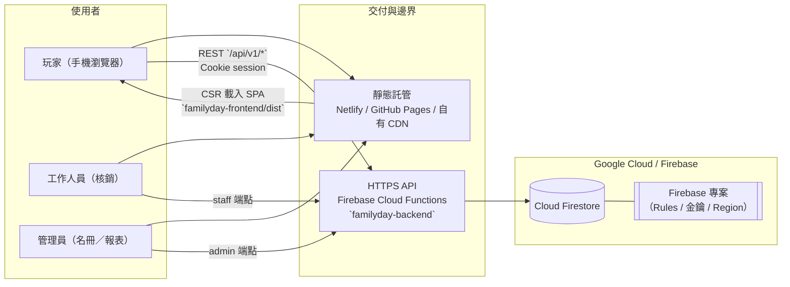
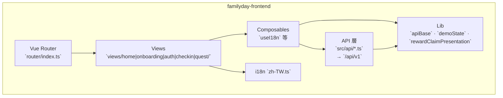
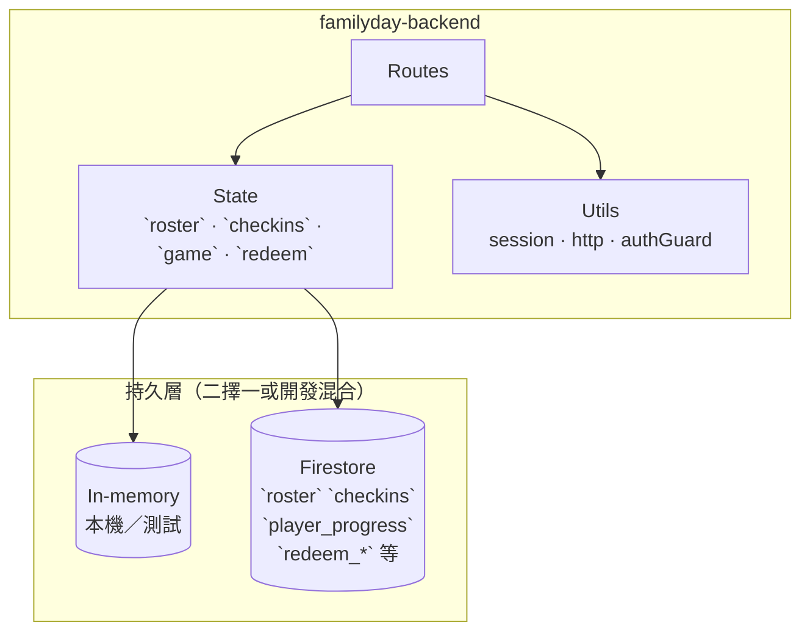
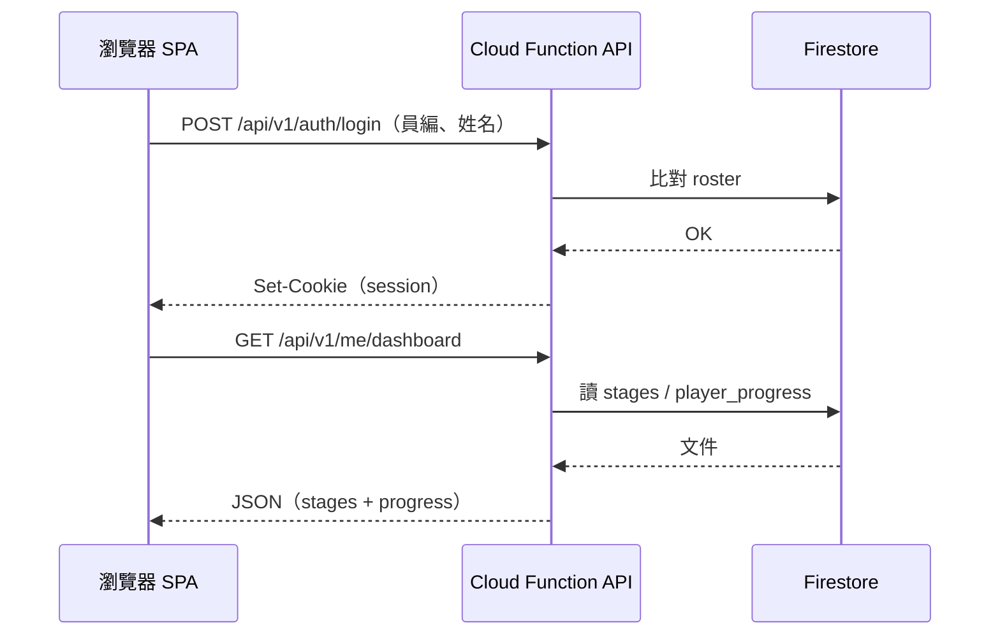
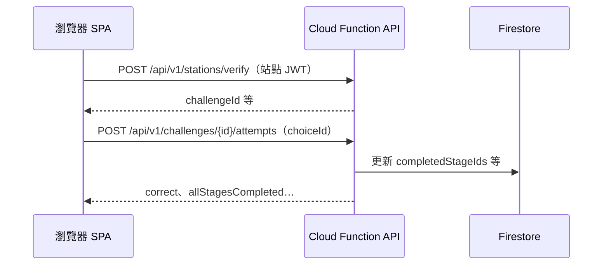
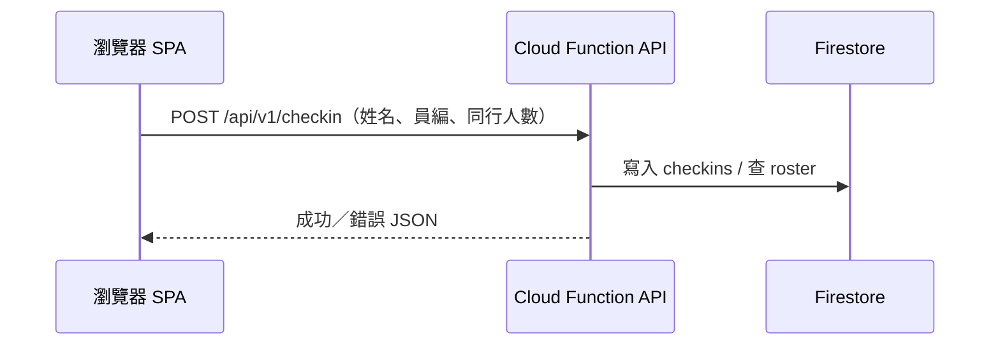

# Family Day Green World — 全系統架構圖（前端 · API · 後端）

> **範圍：** 依倉庫現況彙整 **Vue SPA**、**REST API（`/api/v1`）**、**Firebase Cloud Functions（Express）** 與 **Firestore／本機 in-memory** 雙模式之關係。  
> **契約單一來源：** [`familyday-api-contract/api-v0.1.md`](../../familyday-api-contract/api-v0.1.md)。  
> **程式碼掃描對齊證明（契約 MVP / `routes` / `src/api` / mock）：** 見 **§8**。  
> **補充讀物：** [`summary-frontend.md`](./summary-frontend.md)、[`summary-backend.md`](./summary-backend.md)、[`summary-deployment.md`](./summary-deployment.md)、[`firestore-schema-v1.md`](./firestore-schema-v1.md)。

---

## 1. 系統脈絡圖（C4 Context）

現場參加者與工作人員透過瀏覽器存取前端；前端以 **HTTPS + Cookie（session）** 呼叫後端 API；後端經 **Admin SDK** 讀寫 **Cloud Firestore**。靜態預覽時可僅部署前端（無 API，領獎等以 `sessionStorage` 後備）。



---

## 2. 容器圖（Containers）

三個主要「交付物」：**前端 SPA**、**API 函式（單一 Express app）**、**契約與設定**。資料層可由環境變數切換真實 Firestore 或開發用記憶體儲存。

```mermaid
flowchart TB
  subgraph repo["儲存庫邊界（mono 或拆線後對齊）"]
    FE["`familyday-frontend`\nVue 3 · Vite · TS · Tailwind"]
    BE["`familyday-backend`\nExpress · firebase-functions/v2/https\n`export const api`"]
    CT["`familyday-api-contract`\n`api-v0.1.md` REST 契約"]
    FD["`fdgw.project.json`\neventId · CORS · Firebase 專案後設"]
  end

  subgraph runtime["執行期"]
    MOCK["選用：`mock/server.js`\n本機聯調／Vitest 旁路"]
    MEM["`FDGW_USE_FIRESTORE=false`\nin-memory store"]
    FSW["`FDGW_USE_FIRESTORE=true`\nFirestore"]
  end

  FE -->|"fetch `{VITE_API_BASE}/api/v1/...`"| BE
  CT -.->|"對齊實作"| FE
  CT -.->|"對齊實作"| BE
  FD --> BE

  BE --> MEM
  BE --> FSW
  FE -.->|"開發可指向"| MOCK
```

---

## 3. 前端內部分層（Logical）

路由與畫面在 `views/`；HTTP 與 JSON 正規化集中在 `api/`；無 Vue 的狀態與編排在 `lib/`；Vue 黏著層在 `composables/`。設定 **`VITE_API_BASE`** 時請求後端；未設定時部分畫面使用 **`sessionStorage` 後備**（見 `summary-frontend.md` §2.1）。



**與 API 的主要對應（精簡）：**

| 前端關注點 | 典型模組 | API |
|-------------|-----------|-----|
| 闖關登入／session | `gameFlow`、路由守衛 | `POST /auth/login`、`GET /auth/me`、`POST /auth/logout` |
| 報到 | check-in 流程 views | `POST /checkin`、`GET /checkin/status` |
| 地圖／進度／領獎狀態 | `rewardClaimStatus`、Finish 流程 | **`GET /me/dashboard`**、`POST /me/reward/claim` |
| 掃站 QR、作答 | `StageView`、`QuizView` | `POST /stations/verify`、`GET/POST /challenges/...` |
| 工作人員核銷（若啟用 UI） | — | `POST /staff/redeem/*` |

---

## 4. API 表面結構（後端路由掛載）

`familyday-backend/src/index.ts` 將下列路由器掛在 **`/api/v1`** 之下（順序含 404 處理）。

```mermaid
flowchart LR
  subgraph http["Express `app` → `onRequest` → Cloud Functions"]
    H["`/health` · `/health/ready`"]
    AU["`auth`：login · logout · me"]
    CH["`checkin`：checkin · status"]
    DB["`dashboard`：me/dashboard · me/progress"]
    GM["`game`：events · stations/verify · challenges · playthrough/reward"]
    ST["`staff`：redeem/token · redeem/confirm"]
    AD["`admin`：roster/import · reports"]
  end

  root["`GET/POST ... /api/v1/...`"] --> H
  root --> AU
  root --> CH
  root --> DB
  root --> GM
  root --> ST
  root --> AD
```

**對應原始檔（稽核用）：** `routes/health.ts`、`auth.ts`、`checkin.ts`、`dashboard.ts`、`game.ts`、`staff.ts`、`admin.ts`。

---

## 5. 後端與資料層

路由處理常式呼叫 `src/state/*`（`roster`、`checkins`、`game`、`redeem` 等），再經 **`src/utils/store.ts`** 切換 **Firestore** 或 **in-memory**。Session／Cookie 與防護見 `utils/session.ts`、`utils/authGuard.ts`。



Firestore 集合與可部署項目（Rules、indexes）見 [`firestore-schema-v1.md`](./firestore-schema-v1.md) §1。

---

## 6. 核心請求序列（範例）

### 6.1 闖關登入後載入儀表板



### 6.2 到站掃碼與作答



### 6.3 報到（與闖關分流）



---

## 7. 部署視角（摘要）

| 層 | 常見目標 | 說明 |
|----|-----------|------|
| 前端 | Netlify、GitHub Pages、靜態 CDN | 環境變數 **`VITE_API_BASE`** 指向正式 API 根；詳見 [`summary-deployment.md`](./summary-deployment.md) §1.1 |
| API | Firebase Functions（本 repo 之 `api`） | Region 等取自 `fdgw.project.json` / 設定 |
| 資料 | Firestore + Security Rules | 客戶端預設不直連寫入；以後端 Admin 路徑為主（見 `firestore-schema-v1`） |

---

## 8. 程式碼掃描對齊證明（契約 · 後端 · SPA）

本節為**可重複驗證**之對齊紀錄：以 **Express 原始碼**、**正式前端 `fetch` 呼叫點**、**Mock 伺服器** 對照 **`api-v0.1.md` MVP 列表**。

### 8.1 掃描範圍與方法

| 項目 | 作法 |
|------|------|
| **契約** | [`familyday-api-contract/api-v0.1.md`](../../familyday-api-contract/api-v0.1.md) **§「後端 MVP 落地狀態」**表格；並另列 **§2 活動／進場**之選用端點（未列入 MVP 表者標示「§2」）。 |
| **後端** | 列舉 `familyday-backend/src/routes/*.ts` 內 **`Router` 註冊路徑**（掛載於 `src/index.ts` 之 `/api/v1` 前綴下）。掃描日：2026-05-11。 |
| **正式 SPA** | 於 `familyday-frontend/src` 搜尋 `` `/api/v1` ``；**僅統計執行期會發請求之模組**（`src/api/*.ts`，不含 `*.test.ts`）。 |
| **Mock** | `familyday-frontend/mock/server.js` 以 pathname 分派之路由（本機聯調／`test-all-api.js` 等）。 |

**前綴約定：** 下表「路徑」均指 **`/api/v1` 之後**片段（與程式中 `app.use("/api/v1", …)` 一致）。

### 8.2 端點對齊矩陣（MVP 表 ↔ 實作）

| 方法 | 路徑 | 契約 MVP | 後端實作 | 正式 SPA `src/api` | Mock `server.js` |
|:----:|------|:--------:|----------|----------------------|------------------|
| GET | `/health` | 是 | [`health.ts`](../../familyday-backend/src/routes/health.ts) | 否 | 是 |
| GET | `/health/ready` | 是 | 同左 | 否 | 是 |
| POST | `/auth/login` | 是 | [`auth.ts`](../../familyday-backend/src/routes/auth.ts) | [`authLogin.ts`](../../familyday-frontend/src/api/authLogin.ts) | 是 |
| GET | `/auth/me` | 是 | 同左 | **否**（無 `fetch`） | 是 |
| POST | `/auth/logout` | 是 | 同左 | [`gameFlow.ts`](../../familyday-frontend/src/api/gameFlow.ts) | 是 |
| POST | `/checkin` | 是 | [`checkin.ts`](../../familyday-backend/src/routes/checkin.ts) | [`submitCheckin.ts`](../../familyday-frontend/src/api/submitCheckin.ts) | 是 |
| GET | `/checkin/status` | 是 | 同左 | [`checkinStatus.ts`](../../familyday-frontend/src/api/checkinStatus.ts) | 是 |
| GET | `/me/dashboard` | 是 | [`dashboard.ts`](../../familyday-backend/src/routes/dashboard.ts) | [`rewardClaimStatus.ts`](../../familyday-frontend/src/api/rewardClaimStatus.ts)、[`gameFlow.ts`](../../familyday-frontend/src/api/gameFlow.ts)（`syncLocalProgressFromDashboard`） | 是 |
| GET | `/me/progress` | 是 | [`game.ts`](../../familyday-backend/src/routes/game.ts) | **否**（契約亦註記主流程以 `dashboard` 為準） | 是 |
| POST | `/stations/verify` | 是 | 同 `game.ts` | [`gameFlow.ts`](../../familyday-frontend/src/api/gameFlow.ts) | 是 |
| GET | `/challenges/{challengeId}` | 是 | 同 `game.ts` | [`gameFlow.ts`](../../familyday-frontend/src/api/gameFlow.ts)（`fetchChallenge`） | 是 |
| POST | `/challenges/{challengeId}/attempts` | 是 | 同 `game.ts` | [`gameFlow.ts`](../../familyday-frontend/src/api/gameFlow.ts) | 是 |
| POST | `/me/playthrough/restart` | 是 | 同 `game.ts` | [`gameFlow.ts`](../../familyday-frontend/src/api/gameFlow.ts) | 是 |
| POST | `/me/reward/claim` | 是 | 同 `game.ts` | [`gameFlow.ts`](../../familyday-frontend/src/api/gameFlow.ts) | 是 |
| POST | `/staff/redeem/token` | 是 | [`staff.ts`](../../familyday-backend/src/routes/staff.ts) | **否** | 是 |
| POST | `/staff/redeem/confirm` | 是 | 同左 | **否** | 是 |
| POST | `/admin/roster/import` | 是 | [`admin.ts`](../../familyday-backend/src/routes/admin.ts) | **否** | 是 |
| GET | `/admin/reports/attendance` | 是 | 同左 | **否** | 是 |
| GET | `/admin/reports/progress` | 是 | 同左 | **否** | 是 |

**掃描結論（MVP 與後端）：** `api-v0.1` MVP 表所列 **19** 支端點，在 `familyday-backend/src/routes` 均可找到對應 **HTTP 方法 + 路徑**。

### 8.3 正式 SPA 呼叫彙總（僅 `src/api/*.ts`）

下列為**唯一**含執行期 `` fetch(`${base}/api/v1/...`) `` 之模組與路徑（不含測試檔；掃描日同上）。

| 模組 | `/api/v1` 路徑 |
|------|----------------|
| `authLogin.ts` | `POST …/auth/login` |
| `submitCheckin.ts` | `POST …/checkin` |
| `checkinStatus.ts` | `GET …/checkin/status` |
| `rewardClaimStatus.ts` | `GET …/me/dashboard` |
| `gameFlow.ts` | `POST …/stations/verify`、`GET …/challenges/{id}`、`POST …/challenges/{id}/attempts`、`GET …/me/dashboard`、`POST …/me/playthrough/restart`、`POST …/me/reward/claim`、`POST …/auth/logout` |

### 8.4 契約有載、後端未實作之路由（選用 §2）

| 方法 | 路徑 | 契約位置 | `familyday-backend` | `mock/server.js` |
|------|------|----------|---------------------|------------------|
| GET | `/events/{eventId}` | §2 | **無對應 Router** | 有（固定 `MOCK_EVENT_ID`） |
| POST | `/entry/verify` | §2 | **無對應 Router** | 有 |

> **說明：** §2 列為**活動／進場選用**；目前 **Cloud Functions 後端**專注 MVP 流程；若活動開關或進場 QR 要接上正式 API，需於 `familyday-backend` 新增路由並更新本表。

---

## 9. 修訂紀錄

| 版本 | 日期 | 說明 |
|------|------|------|
| 1.0 | 2026-05-11 | 初稿：依 `familyday-frontend`／`familyday-backend`／`api-v0.1` 彙整之全系統架構圖 |
| 1.1 | 2026-05-11 | **§8**：程式碼掃描對齊證明（契約 MVP 表 ↔ `routes/*.ts` ↔ `src/api` ↔ `mock/server.js`）；§2 選用端點與後端落差表 |
