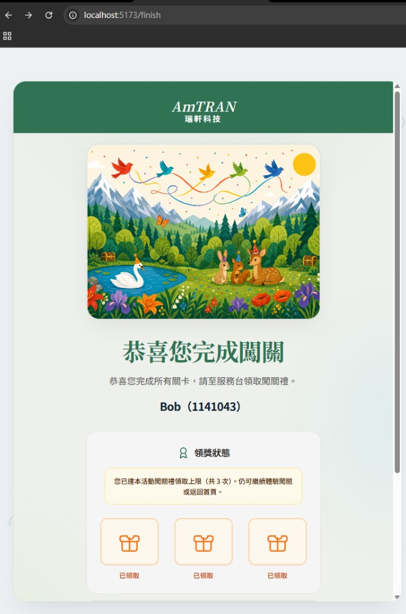
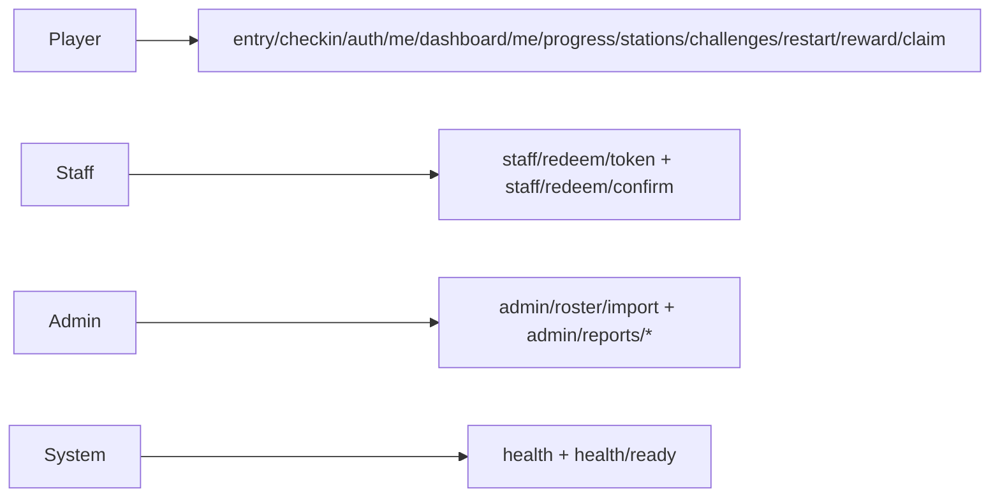

# 根目錄 README — 補充說明（細節）

> 本檔自倉庫根 [`README.md`](../../README.md) 拆出之**長文與表格**，供總覽精簡後在此閱讀。  
> **工作約定不變：** 進度數字仍以根 README [**即時進度**](../../README.md#readme-live-progress) 為準；待辦以 [`project-master` § 待辦事項](../project/project-master.md#work-backlog) 為準。

---

## 詳細快速開始（前端 + Windows + GCP）

### Windows 一鍵（前端 + API + 雲端 Firestore）

倉庫根目錄：

```powershell
.\scripts\dev-oneclick.ps1 -CredentialPath "D:\path\to\your-sa.json"
```

細節（環境變數、`seed/purge`、Rules、故障排除）：

- [`docs/setup/local-firestore-gcp.md`](../setup/local-firestore-gcp.md)
- [`docs/setup/README.md`](../setup/README.md)

<a id="gcp-service-account-local-firestore"></a>

### 設定單一來源（必對齊）

- Firebase 與產品常數：[ `familyday-backend/fdgw.project.json`](../../familyday-backend/fdgw.project.json)
- Firebase CLI 目標專案：[ `familyday-backend/.firebaserc`](../../familyday-backend/.firebaserc)
- 整合測試主清單：[ `docs/testing/api-integration-checklist.md`](../testing/api-integration-checklist.md)
- 金鑰 JSON **不可提交 Git**

### 上線包含／不包含（避免混淆）

| 類別 | 路徑／檔案 | 是否進正式上線執行 | 說明 |
|------|------------|--------------------|------|
| 前端執行碼 | `familyday-frontend/src/**`、`familyday-frontend/public/**` | 會（經 build 後） | 由 `npm run build` 打包成 `familyday-frontend/dist`，提供正式站點執行 |
| 部署產物 | `familyday-frontend/dist/**` | 會（部署時使用） | 最終上線的靜態資源輸出 |
| 單元測試 | `familyday-frontend/src/**/*.test.ts` | 不會 | 僅供本機與 CI 驗證行為；不打包進 production |
| Mock API | `familyday-frontend/mock/**` | 不會（正式環境） | 僅開發／驗證用；正式環境應改接實際後端 |
| CI 設定 | `.github/workflows/*.yml` | 不會（runtime） | 只在 GitHub Actions 執行測試、建置與部署流程 |
| 開發依賴 | `familyday-frontend/node_modules/**` | 不會（runtime） | 建置與開發工具依賴，非部署產物 |

### Windows：Node.js／npm 問題

見 [`docs/setup/nodejs-windows.md`](../setup/nodejs-windows.md)。

<a id="preview-netlify-test-ui"></a>

## 公開預覽部署（測試 Web UI）

見 [`docs/setup/static-preview-netlify-github.md`](../setup/static-preview-netlify-github.md)。

<a id="ui-preview-screenshots"></a>

## 介面預覽（截圖）

以下皆為 **`familyday-frontend/` 生產建置**（`npm run build`）後，以 **390×844**（常見手機寬度）對 `vite preview` 畫面做全頁截圖，與 [Netlify 測試站](#preview-netlify-test-ui)／本機輸出一致。原始檔在 [`docs/preview/screenshots/`](../preview/screenshots/)；重產步驟見 [`docs/media/README.md`](../media/README.md)。若歡迎頁需改放**非建置畫面**之主視覺檔，請手動覆蓋 `preview-welcome.png` 並將 [`tool/capture-preview-screenshots.ps1`](../../tool/capture-preview-screenshots.ps1) 內 **`$CaptureWelcomeFromApp`** 設為 **`$false`**（略過程式重拍該張）。

| 歡迎 `/` | 報到 `/checkin` |
| :---: | :---: |
| [](../preview/screenshots/preview-welcome.png) | [](../preview/screenshots/preview-checkin-form.png) |
| 闖關登入 `/register` | 闖關地圖 `/stage` |
| [](../preview/screenshots/preview-register.png) | [](../preview/screenshots/preview-stage.png) |

**完成領獎**（**定稿**：僅 **`/finish`** 一頁，含恭喜完成闖關、使用者識別、領獎狀態／上限提示）— [](../preview/screenshots/preview-finish.png)  
（已廢止獨立「領取成功」畫面；舊網址 `/finish/claimed` 會 **redirect** 至 `/finish`。）

---

## 專案概覽（完整）

### 專案簡介

| 項目     | 說明                                                                                                        |
| ------ | --------------------------------------------------------------------------------------------------------- |
| 活動     | 新竹北埔**綠世界生態農場**；對象為**台北辦公室同仁及眷屬**（預估約 **1,000～1,300** 人）；活動日**確認中**（偏好**六月底**，或七月初）                       |
| 產品     | 解謎 Web 應用；同仁與家人體驗生態探索，完成關卡可至指定地點領取紀念品                                                                     |
| 提案／線框 PDF | `docs/proposals/FamilyDayApp_Proposal_v1.pdf`（v1，2026.04.10）、[`FamilyDayApp_wireframe_v2.pdf`](../proposals/FamilyDayApp_wireframe_v2.pdf)（線框 v2）；實作畫面見 [介面預覽（截圖）](#ui-preview-screenshots) |
| 需求主文件  | `docs/project/project-master.md`（合併版：需求、待確認、狀態、技術）；索引見 `docs/README.md`                                             |
| 資訊開發人員 | Ken、Brian                                                                                                 |
| GitHub | [BrianChang1212/FamilyDay_GreenWorld](https://github.com/BrianChang1212/FamilyDay_GreenWorld)             |

### 文件來源與紀要

| 項目          | 內容                                                                                                                    |
| ----------- | --------------------------------------------------------------------------------------------------------------------- |
| 需求筆記        | 已結構化寫入 `docs/project/` 等（細節見 `docs/project/project-master.md`）                                                                               |
| 文件體系        | 詳見 [`docs/README.md`](../README.md)（分類索引）→ `docs/project/project-master.md`                                                                  |
| 最後更新 README | 見根 [`README.md`](../../README.md) 頁尾版本列；`project-master` 頁尾版本見主文件。 |

---

## 技術架構（詳細）

| 層級 | 重點 |
| --- | --- |
| 前端 | Vue 3 + Vite + TypeScript + Tailwind + Vue Router（`familyday-frontend/`） |
| 後端 | Firebase（Firestore 為主，Realtime Database 視場景啟用） |
| API 契約 | `familyday-api-contract/api-v0.1.md` |
| 架構摘要 | 前端：`docs/architecture/summary-frontend.md`、後端：`docs/architecture/summary-backend.md`、部署：`docs/architecture/summary-deployment.md`、流量：`docs/architecture/summary-traffic.md` |

### API 觸發時機（簡短版）



- Player：使用者在報到、闖關、作答、再玩一輪時觸發。
- Staff：櫃台核銷與領獎確認時觸發。
- Admin：名冊匯入與營運報表查詢時觸發。
- System：監控與部署健康檢查時觸發。
- 完整版（含分群詳圖與端點表）：[`familyday-api-contract/api-v0.1.md`](../../familyday-api-contract/api-v0.1.md) §12。

### 快速路由（原型）

- 報到入口：`/check-in` -> `/checkin` -> `/checkin/complete`
- 闖關入口：`/game` -> `/` -> `/register` -> `/stage`
- 領獎頁：**`/finish`**（舊 **`/finish/claimed`** → redirect **`/finish`**）

完整流程圖與資料流請看 `docs/project/project-master.md`（需求與流程、技術規格）及 [`docs/architecture/summary-frontend.md`](../architecture/summary-frontend.md)。

---

## 規格與活動內容

| 項目 | 摘要 |
| --- | --- |
| 活動規模 | 約 1,000～1,300 人 |
| 核心功能 | 現場報到 + 闖關遊戲（同一 Web App、不同路由） |
| 報名規則 | 1+3 免費，第 5 人起加收 |
| 闖關規則 | 6 關，答錯可重答，同工號最多 3 次/3 份 |

完整規格與時程請看 [`docs/project/project-master.md`](../project/project-master.md)。

---

## 使用者流程

- 報到：掃報到 QR -> 報到單頁 -> 完成頁（不自動進闖關）
- 闖關：掃闖關入口 QR -> 歡迎/說明 -> 登入 -> 地圖/關卡（**六站完成順序不拘**）-> 完成領獎
- 各關到站：掃現場關卡 QR 驗證

完整分流與畫面順序請看 [`docs/project/project-master.md`](../project/project-master.md) 與 [`docs/architecture/summary-frontend.md`](../architecture/summary-frontend.md)。

---

## 設計資產與會議

**待取得（Action：@Fendy Wei／魏淑芬）**

1. 活動主視覺（Key Visual）— 目標 **4/17 前**確認
2. 企業識別：**Logo、印花圖樣、CIS** 等

**會議**

- 預計 **每週五 10:00** 開會（**A1 會議室**；以行事曆為準）。

**線框** — 靜態以 [`FamilyDayApp_wireframe_v2.pdf`](../proposals/FamilyDayApp_wireframe_v2.pdf) 為準；實作畫面請見 [介面預覽（截圖）](#ui-preview-screenshots) 或 [公開預覽部署（測試 Web UI）](#preview-netlify-test-ui)。

---

<a id="backlog-detail"></a>

## 待辦與進度（詳細）

與根 [`README.md`](../../README.md) **待辦與進度（摘要）**對照用；**權威待辦**仍為 [`project-master` § 待辦事項](../project/project-master.md#work-backlog)。

### 待確認（高優先級節錄）

完整清單見 [`docs/project/project-master.md`](../project/project-master.md)。會議後仍待主辦／表單補齊者例如：

1. 活動**確切日期**（六月底 vs 七月初）
2. 事前報名**表單欄位明細**、收費規則說明、保險文案
3. 簽到 QR 與闖關入口之**導覽與資安**（專屬 QR 發放方式）
4. 報名清冊與現場簽到／闖關後端之**資料切分與同步**

### 技術選型（草案已完成，待會議簽核）

細節見 [`docs/project/project-master.md`](../project/project-master.md)（開頭補充文件表）及 `docs/architecture/summary-*.md`。

1. **前端（草案簽核中；實作現況見根 README 即時進度）：** Vue 3 + Vite + TypeScript + Tailwind + Vue Router；**Naive UI** 可選、尚未納入 `package.json`
2. **Database（定案）：** Firebase（Firestore 為主，Realtime Database 視場景啟用）
3. **RWD：** 需要（手機優先）
4. **Sheet：** 匯入／匯出與同步時機（仍待確認）
5. **部署：** Firebase 專案與 Blaze 預算告警（見 [`docs/architecture/summary-deployment.md`](../architecture/summary-deployment.md)）

### 專案進度（概覽表）

細項見 [`docs/project/project-master.md`](../project/project-master.md)「專案狀態」。

| 項目 | 狀態 |
| ---------------- | --------------------------------------- |
| 需求收集與整理 | 完成 |
| 技術選型 | Cloud Functions + Firestore 路線已落地實作；正式維運參數待簽核 |
| UI/UX 設計（設計稿／KV） | 進行中（功能流程先行，正式視覺資產持續補齊） |
| 開發 | 前端 **100% 實作完整**（11 View、11 API 函式、無 TODO）；後端 **95% 實作完整**（19 端點；`admin/reports/attendance` total 仍 hardcoded）；Firestore 四集合雙模式完整 |
| 測試 | 前端 Vitest 15 檔無 skip 全通過 + CI；後端 in-memory 聯調 Pass 17；**Firestore Blocked**（IAM 憑證）；後端單元測試待補齊 |
| 部署 | **dev/stage 可驗證上架**；正式上線需完成 Firestore IAM 憑證設定、Security Rules 與安全基線 |

### 下一步（本週）— 完整條列

與 [`project-master` § 待辦事項](../project/project-master.md#work-backlog) **對齊**；**勾選與增刪項目以主文件為準**。

**高優先級**

- 完成**目標 Firebase 專案**（與 [`fdgw.project.json`](../../fdgw.project.json) 的 `firebaseProjectId`、金鑰 JSON 內 `project_id`、[ `familyday-backend/.firebaserc`](../../familyday-backend/.firebaserc) 一致）的 Firestore IAM 授權（至少 Cloud Datastore User）
- 確認本機驗證身分已對齊目標專案（`firebase login:list` 需有授權帳號；`GOOGLE_CLOUD_PROJECT=<同上專案 ID>`）
- 重跑 `familyday-backend/` 的 `npm run verify:firestore` 並保存證據（CLI 輸出 + Firestore 查驗）
- 將 Firestore 驗證結果回填 `docs/testing/api-integration-checklist.md`（解除 Blocked；主文件為 §7）
- 修正 `familyday-backend/src/routes/admin.ts`：`GET /admin/reports/attendance` 的 `total`（改為動態查詢 checkins，非 hardcoded `1000`）
- 產出正式上線前**最小安全基線確認單**（憑證、權限、CORS、Cookie）
- 確認 `VITE_API_BASE`、CORS allowlist 與目標驗證網域一致

**中優先級**

- 完成 dev/stage 驗證 **runbook**（含 `VITE_API_BASE`、`FDGW_USE_FIRESTORE`、憑證步驟）
- 補齊 **Firestore Security Rules** 檢核與最小監控告警清單
- 補齊**後端單元測試**與關鍵路徑自動化（auth／checkin／game／redeem）

**低優先級** — 見 [`project-master` § 待辦事項](../project/project-master.md#work-backlog)（k6 壓測規劃、設計資產到位後之 UI 一致性檢查等）。

---

## 儲存庫目錄結構

| 路徑                | 用途                                                                                                                |
| ----------------- | ----------------------------------------------------------------------------------------------------------------- |
| `docs/`           | 見 [`docs/README.md`](../README.md)（含 **`setup/`** 本機與預覽、`project/`、`architecture/`、`media/` 等；**API 契約**僅 [`familyday-api-contract/api-v0.1.md`](../../familyday-api-contract/api-v0.1.md)） |
| `assets/`         | 設計稿、KV、Logo、CIS（註明版本與來源）                                                                                          |
| `familyday-frontend/` | 前端獨立 repo（Vue 3 + Vite + TS + Tailwind + Vue Router）：`npm install` → `npm run dev`；`npm run test`（Vitest） |
| `familyday-backend/` | 後端獨立 repo（Firebase Functions + Firestore 設定）：`npm install` → `npm run build` / `npm run serve` |
| `familyday-api-contract/` | API 契約獨立 repo（`api-v0.1.md` + 契約治理檔） |
| `source/`         | 舊版前端目錄（legacy，僅保留歷史追溯） |
| `functions/`      | 舊版後端目錄（legacy，僅保留歷史追溯） |
| `.claude/skills/`（全域） | Agent skills 由全域管理；本專案不需額外內嵌 skills（非執行期依賴） |
| `test/`           | 倉庫根目錄**驗收／測試紀錄**用（**選用**；目前僅 **`.gitkeep`**）。**程式單元測試**在 **`familyday-frontend/src/**/*.test.ts`**（Vitest），非此資料夾 |
| `tool/`           | 輔助腳本（**選用**）：例如 [`tool/capture-preview-screenshots.ps1`](../../tool/capture-preview-screenshots.ps1)（重產 [`docs/preview/screenshots/`](../preview/screenshots/)，見 [`docs/media/README.md`](../media/README.md)）；另含 **`.gitkeep`** |
| `docs/overview/`  | **本檔**：根 README 之細節補充（截圖、技術圖、目錄表等） |

---

## 文件與維護

| 你想… | 請開 |
| ----- | --- |
| 5 分鐘掌握專案 | 根 [`README.md`](../../README.md) |
| 本機 GCP／Firestore、靜態預覽、Windows Node | [`docs/setup/README.md`](../setup/README.md) |
| 完整需求、待辦、進度、技術 | [`docs/project/project-master.md`](../project/project-master.md) |
| Repo 拆分遷移說明 | [`docs/project/repo-split-migration.md`](../project/repo-split-migration.md) |
| 文件分類索引 | [`docs/README.md`](../README.md) |
| API 契約（v0.1） | [`familyday-api-contract/api-v0.1.md`](../../familyday-api-contract/api-v0.1.md) |
| 前後端／部署／流量摘要 | [`docs/architecture/summary-frontend.md`](../architecture/summary-frontend.md) 等 |
| 介面截圖維護（Preview） | [`docs/media/README.md`](../media/README.md) |
| **根 README 長文／表格（本檔）** | [`docs/overview/root-readme-supplement.md`](./root-readme-supplement.md) |

| 文件 | 建議更新時機 |
| --- | --- |
| `README.md` | 重大變更、里程碑 |
| `docs/overview/root-readme-supplement.md` | 根 README 刪減後需保留之展示／表格式說明變更時 |
| `docs/project/project-master.md` | 需求／技術／會議／進度任一變更時 |
| `docs/setup/**` | 本機指令、預覽網址、腳本參數變更時 |

---

*補充篇 · 自根 README 拆出 · 與根 README 頁尾版本列同步維護*
