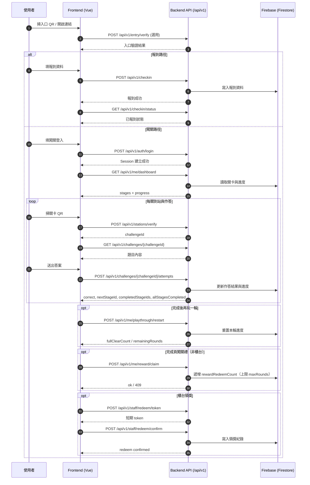

# 家庭日綠世界闖關 Web — API 規格（v0.1 草案）

> 狀態：**假設草案**，供前後端對齊；簽到與闖關登入**分開**、站點 QR 為 **signed JWT**、進度為**作法 A（無獨立 runId）**、關卡瀏覽使用**單一合併** **`GET /api/v1/me/dashboard`**。修訂紀錄見文末（**v0.1.20** 補前端原型：`inZone`／**`pendingStationChallenge`** 與 **`challengeId` query** 綁定註記，避免未掃碼卻進預設題組；**無** REST 契約變更；**v0.1.19** 任意順序通關：`dashboard.stages[].locked` 語意、`attempts` 回應補 **`completedStageIds`**／**`allStagesCompleted`**；**v0.1.18** 聯調註記 CORS 白名單與 **`functions/src/index.ts`** 對齊；**v0.1.17** Mock／整合清單與 **`me/progress`** 對齊；**v0.1.16** 補列 **`GET /api/v1/me/progress`** 落地狀態；**v0.1.15** 文件與 §13 流程圖路徑對齊；**v0.1.14** 同步 Cloud Functions：`auth/checkin` 改走 Firestore roster 驗證，`admin/roster/import` 實作 Firestore 寫入；**v0.1.13** 完成 CORS allowlist 收斂驗證；**不改**端點定義）。

---

## 全域約定

| 項目 | 說明 |
|------|------|
| API Base | `/api/v1` |
| 格式 | `Content-Type: application/json` |
| 認證 | 簽到／闖關登入成功後建議使用 **HTTP-only Cookie（session）**；需登入的 API 未帶有效 session 時回 **401** |
| 傳輸加密 | **正式環境必須使用 HTTPS（TLS 1.2+）**；禁止明文 HTTP 傳輸個資或 token |
| Cookie 安全 | Session Cookie 應設定 `HttpOnly`、`Secure`、`SameSite=Lax`（跨站需求再評估 `SameSite=None; Secure`） |
| 敏感資料保護 | 工號、姓名、token、JWT 不可寫入前端可見 URL query；日誌需遮罩（mask）個資與憑證 |
| 錯誤 | 建議 `{ "code": "STRING", "message": "人可讀說明" }` |
| 限流 | **每位使用者每分鐘最多 30 次請求**（可再細分 bucket）；`login`、`checkin` 建議獨立或較嚴格 |

完整路徑範例：`GET https://<host>/api/v1/me/dashboard`

---

## Firebase 實作對齊註記

本章僅補充「目前後端定案為 Firebase」之實作對齊邊界；**不重**定義本文件既有 REST 路徑與欄位語意。

| 對齊面向 | 註記 |
|------|------|
| 架構定案來源 | 以 `docs/architecture/summary-backend.md`（v1.5）為準：Firebase（Firestore 為主，Realtime Database 視場景啟用） |
| API 契約定位 | 本文件維持「HTTP API 契約層」；底層可由 Cloud Functions / Cloud Run / Server 介面實作，對前端契約不變 |
| 資料主來源 | 簽到、闖關進度、作答、領獎等交易資料以 Firestore 為主；Google Sheet 僅作匯入/匯出與報表輔助 |
| 認證與授權 | `auth/*`、`staff/*` 端點之身份驗證與權限檢查，需對齊 Firebase Authentication 與 Security Rules/後端授權策略 |
| 站點 QR 安全 | `stations/verify` 仍以 signed JWT 驗簽、`exp`、`jti` 防重播為最低要求；不得僅信任前端傳入站點參數 |
| 成本與容量 | 用量估算、預算告警與連線策略以 `summary-backend.md`、`summary-traffic.md`、`summary-deployment.md` 為準，本檔不重複維護計價表 |

---

## Mock 驗證差異註記（`source/mock/server.js`）

此章節僅描述目前 mock server 之簡化行為，避免與正式 API 契約混淆：

| 項目 | 目前 Mock 行為 | 正式契約定位 |
|------|------|------|
| `POST /api/v1/checkin` | 需符合 `source/mock/db.json` 的 `employees` 對照；不符回 `401 CHECKIN_IDENTITY_MISMATCH` | 正式版應依名冊/身份服務驗證 |
| `GET /api/v1/events/{eventId}` | 僅實作固定路徑 `/api/v1/events/familyday-2026` | 正式版維持 `{eventId}` 動態路由 |
| `POST /api/v1/stations/verify` | 僅 smoke 回應，未實作 JWT 驗簽/exp/jti；回傳之 **`challengeId`** 須與請求 **`stageId`** 對應（原型與 `functions` 一致） | 正式版需完整 JWT 安全檢查 |
| `GET /api/v1/me/dashboard` | 回應為前端驗證所需最小欄位集 | 正式版回應以本文件示例為準 |
| `POST /api/v1/challenges/{challengeId}/attempts` | request 用 `answer`，response 含 **`correct`**、**`nextStageId`**、**`completedStageIds`**、**`allStagesCompleted`**（與 `functions` 一致） | 正式版請求仍以 **`choiceId`**（相容 `answer`）為準 |

---

## Cloud Functions MVP 落地狀態（2026-04-30）

以下為 `functions/` 目前已落地的最小端點（Firebase Functions emulator 已驗證）：

| 端點 | 狀態 | 備註 |
|------|------|------|
| `GET /api/v1/health` | 已落地 | 存活檢查 |
| `GET /api/v1/health/ready` | 已落地 | 就緒檢查 |
| `POST /api/v1/auth/login` | 已落地 | 以員編+姓名比對 **Firestore `roster`**，回傳 HTTP-only cookie session |
| `GET /api/v1/auth/me` | 已落地 | 需帶有效 session；否則 401 |
| `POST /api/v1/auth/logout` | 已落地 | 清除 session cookie |
| `POST /api/v1/checkin` | 已落地 | 名冊比對通過後寫入 `checkins`（`FDGW_USE_FIRESTORE=true` 時落地 Firestore） |
| `GET /api/v1/checkin/status` | 已落地 | 回傳最新或指定員編報到狀態 |
| `GET /api/v1/me/dashboard` | 已落地 | 回傳 stages + progress 最小欄位集 |
| `GET /api/v1/me/progress` | 已落地 | 僅回傳 **`player_progress`** 文件內容（除錯／聯調）；**主流程**仍以 **`GET /api/v1/me/dashboard`** 為準；前端 **SPA 目前未**呼叫此端點 |
| `POST /api/v1/stations/verify` | 已落地 | 第二階段先提供最小驗證邏輯（JWT 驗簽仍待下一階段） |
| `GET /api/v1/challenges/{challengeId}` | 已落地 | 僅回傳 `challengeId`；題幹／選項文案由前端題庫負責；後端只驗證作答並更新過關進度 |
| `POST /api/v1/challenges/{challengeId}/attempts` | 已落地 | 支援 `choiceId`（並相容 `answer`） |
| `POST /api/v1/me/playthrough/restart` | 已落地 | 未滿足條件回 409 |
| `POST /api/v1/me/reward/claim` | 已落地 | Finish 頁玩家確認領獎時遞增 `rewardRedeemCount`（須已全通關且符合輪次規則；否則 409） |
| `POST /api/v1/staff/redeem/token` | 已落地 | 回傳短期 token（`FDGW_USE_FIRESTORE=true` 時落地 Firestore） |
| `POST /api/v1/staff/redeem/confirm` | 已落地 | 成功時遞增 `progress.rewardRedeemCount` 並寫入核銷紀錄；失敗回 409（`code` 如 `REDEEM_LIMIT_REACHED`、`INVALID_REDEEM_TOKEN` 等） |
| `POST /api/v1/admin/roster/import` | 已落地 | 寫入 Firestore `roster`（`items[]` 匯入） |
| `GET /api/v1/admin/reports/attendance` | 已落地 | 第二階段先回最小統計欄位 |
| `GET /api/v1/admin/reports/progress` | 已落地 | 第二階段先回最小統計欄位 |

---

### 聯調驗證註記（2 小時清單，2026-04-30）

- 核心流程（登入、報到、闖關、dashboard）可由 Functions emulator 端到端打通。
- `401/409` 邊界行為已驗證：
  - 未登入呼叫 `GET /api/v1/auth/me` 回 `401`
  - 未滿足條件呼叫 `POST /api/v1/me/playthrough/restart` 回 `409`
- CORS allowlist 已收斂（與 **`functions/src/index.ts`** 一致）：`http://localhost:5173`、`http://localhost:4173`、`http://127.0.0.1:5173`、`http://127.0.0.1:4173`、`https://familyday-greenworld.netlify.app`、`https://brianchang1212.github.io`。
- 非白名單來源（例：`https://evil.example.com`）驗證結果為無 ACAO 回應，符合阻擋預期。

---

## 1. 健康檢查

| 方法 | 路徑 | 說明 |
|------|------|------|
| GET | `/api/v1/health` | 存活檢查（可不查資料庫） |
| GET | `/api/v1/health/ready` | 就緒檢查（含資料庫連線） |

---

## 2. 活動／進場（選用，依 QR 設計）

| 方法 | 路徑 | 說明 |
|------|------|------|
| GET | `/api/v1/events/{eventId}` | 活動是否開放、顯示名稱、設定版本（利於快取） |
| POST | `/api/v1/entry/verify` | 進場 QR 內 **signed JWT** 或 token，**伺服器驗簽**後再進簽到／登入頁 |

**`POST /api/v1/entry/verify` 請求體（示例）**

```json
{
  "token": "<jwt_or_compact_payload>"
}
```

---

## 3. 簽到（與闖關分開）

| 方法 | 路徑 | 說明 |
|------|------|------|
| POST | `/api/v1/checkin` | 送出簽到（工號、姓名、同行人數等，依表單／名冊） |
| GET | `/api/v1/checkin/status` | 查是否已簽到（供 UI） |

**`POST /api/v1/checkin` 請求體（示例）**

```json
{
  "employeeId": "1141041",
  "name": "Brian",
  "partySize": 3
}
```

> Cloud Functions 實測以 Firestore `roster` 為準；mock server 測試才使用 `source/mock/db.json` 的 `employees`。

---

## 4. 闖關登入

| 方法 | 路徑 | 說明 |
|------|------|------|
| POST | `/api/v1/auth/login` | 工號＋姓名驗證（名冊），建立**闖關用 session** |
| POST | `/api/v1/auth/logout` | 登出 |
| GET | `/api/v1/auth/me` | 目前登入者摘要（工號、顯示名等） |

**`POST /api/v1/auth/login` 請求體（示例）**

```json
{
  "employeeId": "E12345",
  "name": "王小明"
}
```

---

## 5. 關卡瀏覽（合併 API）

| 方法 | 路徑 | 說明 |
|------|------|------|
| GET | `/api/v1/me/dashboard` | **六關列表 + 個人進度 + 通關／輪次狀態**（關卡瀏覽頁建議僅呼叫此端點） |

**`GET /api/v1/me/dashboard` 回應（示例）**

```json
{
  "event": {
    "id": "greenworld-2026",
    "name": "瑞軒家庭日"
  },
  "stages": [
    { "id": 1, "title": "水鳥區", "order": 1, "locked": true },
    { "id": 2, "title": "大探奇區", "order": 2, "locked": true },
    { "id": 3, "title": "水生植物公園", "order": 3, "locked": false }
  ],
  "progress": {
    "currentStageId": 2,
    "completedStageIds": [1, 2],
    "allCompleted": false,
    "fullClearCount": 0,
    "rewardRedeemCount": 0,
    "canStartNewRound": false,
    "maxRounds": 3
  }
}
```

> **`stages[].locked`（2026-05 實作）：** **`true`** = 該站**已答對**（進度已記入 `completedStageIds`，不需再佔名額）；**`false`** = **尚未完成**，玩家可任選順序到站作答。**`order`／`title`** 僅供地圖／導覽顯示，**不**代表必須依序遊玩。

**作法 A（無獨立 runId）**：進度以單一使用者狀態表示；**六關可任意順序完成**，`completedStageIds` 集滿 6 個相異站別即視為一輪全通（與陣列排序無關）；`fullClearCount` 僅統計「再玩一輪」次數（**不**限制闖關重玩）；**`maxRounds` 表示闖關禮最多可領次數**（預設 3）。`currentStageId` 為**最後答對之站**（除錯／顯示用），**不**表示「下一必玩站」。`canStartNewRound` 等由 API 組裝。**選用：** `rewardRedeemCount` 供「領取成功」三格狀態；未實作時前端可暫以 `fullClearCount` 映射（以前後端定案為準）。

---

## 6. 站點 QR（signed JWT）

| 方法 | 路徑 | 說明 |
|------|------|------|
| POST | `/api/v1/stations/verify` | 掃描**該關實體 QR** 所得 JWT：**驗簽**、**exp**、必要時 **jti 防重播**；通過後回傳挑戰資訊 |

**請求體（示例）**

```json
{
  "stageId": 3,
  "qrJwt": "<signed_jwt_from_qr>"
}
```

**回應（示例）**

```json
{
  "ok": true,
  "challengeId": "ch_01HZZZZ",
  "expiresAt": "2026-06-30T12:00:00Z"
}
```

---

## 7. 題目與作答

| 方法 | 路徑 | 說明 |
|------|------|------|
| GET | `/api/v1/challenges/{challengeId}` | 確認題目代號存在；**回應僅含 `challengeId`**（題幹／選項顯示由前端） |
| POST | `/api/v1/challenges/{challengeId}/attempts` | 送作答代號（`A`–`D`）；錯誤可再送；後端更新是否過關與進度 |

**`GET /api/v1/challenges/{challengeId}` 回應（示例）**

```json
{
  "challengeId": "c1"
}
```

**`POST /api/v1/challenges/{challengeId}/attempts` 請求體（示例）**

```json
{
  "choiceId": "B"
}
```

`choiceId`（或相容欄位 `answer`）須為 **`A`–`D`** 之一，並與後端該題之正解代號比對；後端**不**下發題幹或選項文字。**選項顯示與題幹**由前端依 `challengeId`（如 `c1`…`c6`）對照本地題庫／i18n。

**回應（示例）**

```json
{
  "correct": true,
  "nextStageId": 3,
  "completedStageIds": [1, 2, 3],
  "allStagesCompleted": false
}
```

- **`completedStageIds`**：答對後**當輪**已通關之站別（1–6，遞增排序）。  
- **`allStagesCompleted`**：本輪是否已集滿 6 站（`true` 時 **`nextStageId`** 可為 **`null`**）。  
- **`nextStageId`**：與 **`currentStageId`** 對齊之提示欄位（**非**強制下一線性關）；答錯時可省略或沿用請求前之進度。

答錯時可回 `{ "correct": false, "nextStageId": <unchanged>, "completedStageIds": [...] }`；仍受每分鐘請求上限約束。

**與前端本地重置對齊：** 若使用者已全通關且 **`rewardRedeemCount >= bankedFullClears`**（上一輪獎勵已領），但前端未呼叫 **`POST /api/v1/me/playthrough/restart`**（例如從首頁重置本地關卡後再玩），則在 **第 1 關（`c1`）答對**時，後端會自動清空本輪 `completedStageIds` 並 **`fullClearCount` +1**，等同補做 restart，以便 **`bankedFullClears`** 能在新一輪通關時再次遞增。

---

## 8. 再玩一輪（作法 A）

| 方法 | 路徑 | 說明 |
|------|------|------|
| POST | `/api/v1/me/playthrough/restart` | 已全通關時**重置本輪進度**（可無限次再玩）；`fullClearCount` 僅遞增統計；**`remainingRounds` 為 `null`**（不再代表剩餘可玩輪數） |

**回應（示例）**

```json
{
  "ok": true,
  "fullClearCount": 1,
  "remainingRounds": null
}
```

`remainingRounds`：**`null`** 表示闖關重玩**不**受輪數上限約束（領獎上限仍見 `progress.maxRounds` 與 `rewardRedeemCount`）。若未通關即重開，回 **409** 並附 `code`。

### 8.1 Finish 頁領獎計次（玩家）

| 方法 | 路徑 | 說明 |
|------|------|------|
| POST | `/api/v1/me/reward/claim` | 使用者在 **完成頁（Finish）** 按「確認領獎」時呼叫；成功則 **`rewardRedeemCount` 加 1**。**須**已通關、**且** `rewardRedeemCount < maxRounds`（領獎最多 3 次）、**且** `bankedFullClears > rewardRedeemCount`（每次「整輪六關全通關」累計於 `bankedFullClears`，未領過的通關才可領一次）。 |

**回應（示例）**

```json
{
  "ok": true,
  "rewardRedeemCount": 1
}
```

不符合條件時回 **409**，`code` 例如：`FINISH_CLAIM_NOT_READY`、`REWARD_CLAIM_LIMIT_REACHED`、`REWARD_CLAIM_NOT_ELIGIBLE`（尚無可領的通關額度，例如已領滿本輪或尚未累計 `bankedFullClears`）。

---

## 9. 櫃台領獎（工作人員）

| 方法 | 路徑 | 說明 |
|------|------|------|
| POST | `/api/v1/staff/redeem/token` | 玩家符合資格後，產生**短期**領獎用 token／內容供櫃台掃描（需玩家已登入） |
| POST | `/api/v1/staff/redeem/confirm` | **工作人員帳號**（權限驗證）確認領獎並寫入紀錄 |

若第一版改為純人工核對畫面、不建 staff 帳號，可列為 **Phase 2**。

---

## 10. 管理後台（選用）

| 方法 | 路徑 | 說明 |
|------|------|------|
| POST | `/api/v1/admin/roster/import` | 匯入報名名冊 |
| GET | `/api/v1/admin/reports/attendance` | 出席報表 |
| GET | `/api/v1/admin/reports/progress` | 闖關統計 |

亦可改由離線腳本寫入資料庫，不必暴露 HTTP。

---

## 11. 前端畫面與 API 對照

| 畫面／動作 | API |
|------------|-----|
| 進場驗證（若有） | `POST /api/v1/entry/verify` |
| 簽到 | `POST /api/v1/checkin`、`GET /api/v1/checkin/status` |
| 闖關登入 | `POST /api/v1/auth/login` |
| 關卡瀏覽／手動刷新 | `GET /api/v1/me/dashboard` |
| 掃站點 QR | `POST /api/v1/stations/verify` |
| 載入題目／作答 | `GET /api/v1/challenges/{challengeId}`、`POST /api/v1/challenges/{challengeId}/attempts` |
| 再玩一輪 | `POST /api/v1/me/playthrough/restart` |
| Finish 頁 Modal「確認領獎」 | **`POST /api/v1/me/reward/claim`**（成功後再導 **`/finish/claimed`**；**已領滿**時前端可停留 **`/finish`** 顯示上限提醒，不強制導向 claimed） |
| 領取成功頁（闖關禮狀態呈現） | 與關卡瀏覽共用 **`GET /api/v1/me/dashboard`**；讀取 `progress.rewardRedeemCount`（選用）或暫用 `fullClearCount`（見 §5 示例） |
| 櫃台掃碼核銷（若有） | `POST /api/v1/staff/redeem/token`、`POST /api/v1/staff/redeem/confirm` |

**實作測試（前端 · 不變更上表契約）：** `source/src/api/rewardClaimStatus.test.ts`（**Vitest**）等，驗證客戶端對 **`dashboard.progress`** 之映射與錯誤處理；**後端**仍須依本規格實作與回傳 JSON。

---

## 12. 端點觸發時機圖（Player / Staff / Admin / System）

以下將端點依「觸發角色／時機」分群，避免把營運後台端點誤判為玩家主流程必要呼叫。

```mermaid
flowchart LR
  subgraph P[Player Web Flow]
    P1[掃入口 QR] --> P2[POST /api/v1/entry/verify]
    P3[報到送出] --> P4[POST /api/v1/checkin]
    P5[報到頁查狀態] --> P6[GET /api/v1/checkin/status]
    P7[闖關登入] --> P8[POST /api/v1/auth/login]
    P9[頁面初始化/刷新] --> P10[GET /api/v1/auth/me]
    P11[關卡總覽/領取狀態] --> P12[GET /api/v1/me/dashboard]
    P13[掃站點 QR] --> P14[POST /api/v1/stations/verify]
    P15[題目頁載入] --> P16[GET /api/v1/challenges/{challengeId}]
    P17[送答案] --> P18[POST /api/v1/challenges/{challengeId}/attempts]
    P19[再玩一輪] --> P20[POST /api/v1/me/playthrough/restart]
  end

  subgraph S[Staff Counter Flow]
    S1[櫃台人員登入後開啟核銷] --> S2[POST /api/v1/staff/redeem/token]
    S2 --> S3[POST /api/v1/staff/redeem/confirm]
  end

  subgraph A[Admin Ops Flow]
    A1[活動前/中名冊更新] --> A2[POST /api/v1/admin/roster/import]
    A3[營運看報到] --> A4[GET /api/v1/admin/reports/attendance]
    A5[營運看闖關進度] --> A6[GET /api/v1/admin/reports/progress]
  end

  subgraph H[System Health]
    H1[監控/部署 smoke check] --> H2[GET /api/v1/health]
    H1 --> H3[GET /api/v1/health/ready]
  end
```

**表（§12）：** 下列「端點」欄為 **`/api/v1` 之後的路徑片段**（與 §1 **API Base** 約定一致；完整範例 **`GET /api/v1/me/dashboard`**）。

| 分群 | 端點 | 典型觸發時機 |
|------|------|--------------|
| Player | `/entry/verify` | 入口 QR 驗證（選用） |
| Player | `/checkin`、`/checkin/status` | 報到送出與報到狀態回查 |
| Player | `/auth/login`、`/auth/logout`、`/auth/me` | 闖關登入、登出、頁面重整後 session 恢復 |
| Player | `/me/dashboard` | 關卡總覽、進度刷新、領取成功頁狀態顯示 |
| Player | `/me/progress` | 除錯／聯調讀取 raw **`player_progress`**（主流程仍以 **`/me/dashboard`** 為準） |
| Player | `/stations/verify`、`/challenges/*` | 到站驗證與作答循環 |
| Player | `/me/playthrough/restart` | 完成一輪後重啟下一輪 |
| Player | `/me/reward/claim` | 完成頁闖關禮「確認領獎」 |
| Staff | `/staff/redeem/*` | 櫃台核銷與領獎確認 |
| Admin | `/admin/roster/import`、`/admin/reports/*` | 名冊匯入與營運報表 |
| System | `/health`、`/health/ready` | 監控、部署後健康檢查 |

---

## 13. 前端與後端 API 實際動作流程圖

以下示意「使用者從進場到領獎」的主要 API 往返路徑，供前後端與測試對齊。



---

## 修訂紀錄

| 版本 | 日期 | 說明 |
|------|------|------|
| v0.1 | 2026-04-10 | 初稿：整合簽到／登入分開、JWT 站點、作法 A、合併 dashboard |
| v0.1.1 | 2026-04-18 | §5：`progress` 示例補**選用** `rewardRedeemCount`；§11：補「領取成功頁」與 dashboard 對照（與前端 `rewardClaimStatus.ts` 對齊） |
| v0.1.2 | 2026-04-19 | §11：補註前端已將 dashboard 讀取與畫面編排分離（`api/rewardClaimStatus.ts`、`lib/rewardClaimPresentation.ts`、`composables/useRewardClaimPresentation.ts`）；**端點與欄位語意**仍以此規格為準 |
| v0.1.3 | 2026-04-19 | §11：補 **Vitest** 客戶端測試註記（`rewardClaimStatus.test.ts` 等）；**不重**定義 REST 路徑或 `progress` 語意 |
| v0.1.4 | 2026-04-19 | 檔首：**dashboard** 端點改為 **`GET /api/v1/me/dashboard`**（與本文端點表一致；**無**契約變更） |
| v0.1.5 | 2026-04-27 | 新增「Firebase 實作對齊註記」：補充 API 契約層與 Firebase 定案（Firestore/Realtime DB/Auth/Security Rules）之連動邊界；**不改**端點 |
| v0.1.6 | 2026-04-27 | 新增「前端與後端 API 實際動作流程圖」：補充從進場、報到、闖關到領獎的前後端呼叫順序 |
| v0.1.7 | 2026-04-27 | 全域約定新增「傳輸加密 / Cookie 安全 / 敏感資料保護」：要求 HTTPS（TLS 1.2+）與個資遮罩，降低資料外洩風險 |
| v0.1.8 | 2026-04-28 | 新增 mock 驗證差異註記：補 `checkin` 身分對照、`events` 固定路徑、`stations/verify` 安全檢查範圍與 `attempts` mock 欄位差異 |
| v0.1.9 | 2026-04-28 | 新增「端點觸發時機圖」：依 Player / Staff / Admin / System 分群標示 API 呼叫時機，並將原流程圖章節調整為 §13 |
| v0.1.10 | 2026-04-30 | 新增「Cloud Functions MVP 落地狀態」：標示已落地與未落地端點（`functions/` 第一階段） |
| v0.1.11 | 2026-04-30 | 更新第二階段落地狀態：新增 game/staff/admin 端點已落地註記（仍採 in-memory） |
| v0.1.12 | 2026-04-30 | 新增 2 小時聯調驗證註記：確認核心流程與 401/409 邊界行為，並記錄 CORS allowlist 仍待收斂 |
| v0.1.13 | 2026-04-30 | CORS allowlist 收斂完成並驗證：白名單來源可用，非白名單來源不回傳 ACAO |
| v0.1.14 | 2026-05-01 | 同步 Cloud Functions 最新實作：`auth/login`、`checkin` 改為 Firestore `roster` 身分比對；`admin/roster/import` 改為實際寫入 Firestore；MVP 落地表與測試註記同步更新 |
| v0.1.15 | 2026-05-03 | §11 Finish 列：補**已領滿**可停留 **`/finish`**。§13 流程圖：序列圖內路徑統一 **`/api/v1`** 前綴；補 **`POST /api/v1/me/reward/claim`** 選用區塊。根 `README`、`firestore-schema-v1`、`summary-frontend`、`project-master` 與領滿完成頁行為敘述同步 |
| v0.1.16 | 2026-05-03 | Firebase 實作對齊註記之 MVP 落地表：補 **`GET /api/v1/me/progress`**（`functions/src/routes/game.ts`；主流程仍以 dashboard 為準） |
| v0.1.17 | 2026-05-03 | **`source/mock/server.js`** 補 **`GET /api/v1/me/progress`**（`scenario` 與 dashboard 一致）；**`test-all-api.js`** 補 **`me/progress`**／**`reward/claim`**；**`test-game-api.js`** 驗證 **`me/progress`** 欄位；**`api-integration-checklist.md`** §9.5／§9.6 與根 **`README`** API 字串同步；§12 觸發表補 **`/auth/logout`**、**`/me/progress`**、**`/me/reward/claim`** |
| v0.1.18 | 2026-05-03 | 聯調驗證註記：CORS allowlist 補列 **`127.0.0.1:5173`／`4173`**（與 **`functions/src/index.ts`** 一致） |
| v0.1.19 | 2026-05-03 | §5：`stages[].locked` 改為「**已通關**為 **`true`**」；補**任意順序**六關與 **`currentStageId`** 說明。§7：`attempts` 回應補 **`completedStageIds`**、**`allStagesCompleted`** 與範例 JSON；§13 流程圖註記同步；Mock 差異表 §「Firebase 實作對齊註記」更新 |
| v0.1.20 | 2026-05-03 | Mock 差異表：`stations/verify` 補「**`challengeId` 與 `stageId` 對應**」。**`summary-frontend` v1.29**：前端以 **`fdgw_pending_station_challenge`** 綁定選站與驗證回傳之 **`challengeId`**，**`getInZone()`** 僅 **`fdgw_inZone === "1"`** 為 true；**`/quiz`** 必帶 **`challengeId` query**（見 `StageView.vue`／`QuizView.vue`／`ResultView.vue`）。**無**端點或 JSON 契約變更 |
