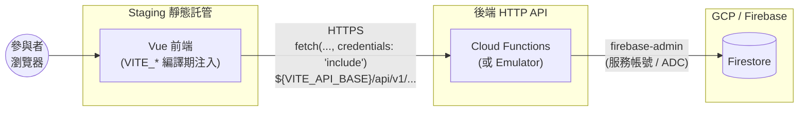
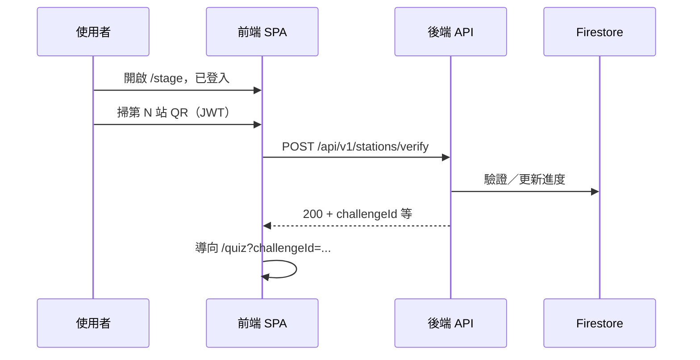
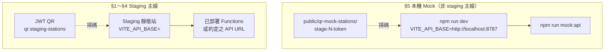

# Staging 上線／聯調檢核表

> 對照 **`docs/api/api-v0.1.md`** 與 **`familyday-frontend/src/lib/apiBase.ts`**。  
> Mock 專用 QR：`familyday-frontend/public/qr-mock-stations/`（`stage-N-token`）；正式／staging 請用後端 JWT 與 `npm run qr:staging-stations`（輸出於 **`public/qr-staging-stations/`**，預設 gitignored）。

## 架構圖（Staging 聯調視角）

下列圖示僅協助對照下方檢核章節；實際 URL、專案 ID、Hosting 網域以 `fdgw.project.json`／部署設定為準。前端不向 Firestore 直連 SDK，一律經 **`VITE_API_BASE`** 對後端 **`/api/v1/...`**（見 `familyday-frontend/src/lib/apiBase.ts`）。

### Staging：部署拓樸與資料流

- **§1 環境**：`VITE_API_BASE` 決定箭頭「前端 → BE」指向哪一個 API 根。  
- **§2 跨網域**：Staging 前端網域須列入後端 **CORS**；**Cookie** 必須在該瀏覽器路徑下可送達 API。  
- **§4 進度／儀表板**：業務資料讀寫經 BE 落入 **Firestore**（非瀏覽器直連）。

### Staging：闖關掃碼 → Quiz（成功路徑）

- **§3**：QR 內容為後端簽發之 **JWT**（與 mock 的 `stage-N-token` 不同）。  
- **負向測試**（§4）：未登入、錯關、過期 JWT 時，API 回應碼與 UI 提示須可接受。

### Mock 主線 vs Staging 主線（對照）

## 1. 環境與 API 基底

- [ ] 在本機建立 **`familyday-frontend/.env.local`**（勿 commit），設定 **staging 的 `VITE_API_BASE`**。
- [ ] 確認基底為 **API 主機根路徑**（無尾隨 `/`）；程式會 `${base}/api/v1/...` 呼叫（例如 `.../stations/verify`）。
- [ ] 可選：`VITE_API_CONTRACT_VERSION` 與文件版號對齊。
- [ ] **部署 staging 靜態站**時於 CI／Hosting 注入 **同一組 `VITE_API_BASE`**。

## 2. 跨網域與登入狀態

- [ ] 與後端確認 **CORS** 已允許 staging 前端來源（可比對根目錄 `fdgw.project.json` 之 `corsOrigins`，staging 網域需列入）。
- [ ] 確認 **`fetch(..., credentials: "include")`** 所需之 **Cookie**（`SameSite`、`Secure`、網域）在瀏覽器實測可帶上。
- [ ] **先登入成功**再測闖關；未登入時 `stations/verify` 應為 **401** 等預期行為。

## 3. 六張正式 QR（JWT）

- [ ] 向後端索取 **staging 可用的 6 段 payload**（每站不同 signed JWT）。
- [ ] 以工具或 `npm run qr:staging-stations`（見 `familyday-frontend/scripts/`）產出 6 張 PNG。
- [ ] **勿**將 mock 用 `stage-N-token` 用於正式場。
- [ ] 若 QR 內為 **完整 URL**：確認後端 verify 吃「整串」或「query 內 token」；後者才需前端抽取（契約內訂）。

## 4. Staging 端到端測試

- [ ] 開 staging 前端，**登入成功**。
- [ ] 進 **`/stage`**，依 UX **先選第 N 關**（若流程仍要求）。
- [ ] 掃 **第 N 站 JWT QR** → 預期 **`POST .../stations/verify` 成功** → 導向 **`/quiz?challengeId=...`**。
- [ ] **作答 → 結果／進度** 與 Firestore／儀表板預期一致。
- [ ] **負向**：錯關、過期／無效 JWT、未登入 — 錯誤碼與 UI 可接受。

## 5. 本機 Mock（非 staging 主線）

- [ ] 終端一：`cd familyday-frontend && npm run mock:api`
- [ ] **`/.env.local`** 設 `VITE_API_BASE=http://localhost:8787`（見 `api-mock-testing.md`）。
- [ ] 終端二：`npm run dev`
- [ ] 使用 `stage-1-token` … `stage-6-token` 圖或 `npm run qr:mock-stations`。

## 6. 版控與交付

- [ ] 掃碼進 quiz、腳本、`package-lock.json` 等已 **commit + push**，與部署一致。
- [ ] 與後端約定 **staging 測試 JWT 申請／輪替** 聯絡窗口。
