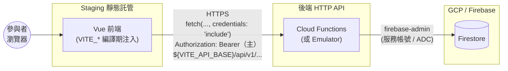
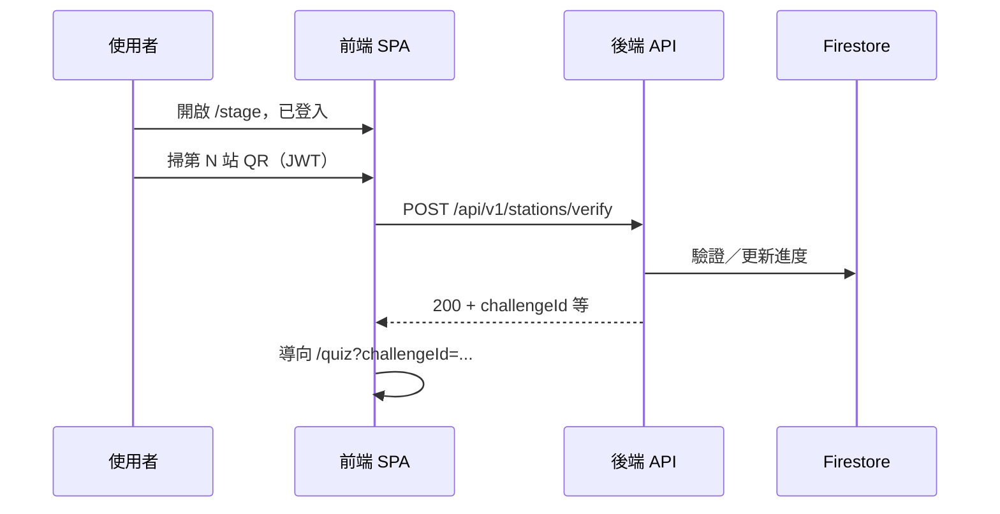
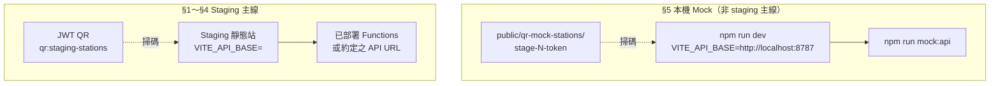

# Staging 上線／聯調檢核表

> 對照 **`docs/api/api-v0.1.md`** 與 **`familyday-frontend/src/lib/apiBase.ts`**。  
> Mock 專用 QR：`familyday-frontend/public/qr-mock-stations/`（`stage-N-token`）；正式／staging 請用後端 JWT 與 `npm run qr:staging-stations`（輸出於 **`public/qr-staging-stations/`**，預設 gitignored）。

## 架構圖（Staging 聯調視角）

下列圖示僅協助對照下方檢核章節；實際 URL、專案 ID、Hosting 網域以 `fdgw.project.json`／部署設定為準。前端不向 Firestore 直連 SDK，一律經 **`VITE_API_BASE`** 對後端 **`/api/v1/...`**（見 `familyday-frontend/src/lib/apiBase.ts`）。

### Staging：部署拓樸與資料流

- **§1 環境**：`VITE_API_BASE` 決定箭頭「前端 → BE」指向哪一個 API 根。  
- **§2 跨網域**：Staging 前端網域須列入後端 **CORS**；後端 **`allowedHeaders`** 須含 **`Authorization`**。前端登入後須帶 **`Authorization: Bearer <token>`**（見 **`familyday-frontend/src/lib/sessionToken.ts`**）；**`fetch(..., credentials: "include")`** 仍可保留（Cookie 相容／雙軌）。  
- **§4 進度／儀表板**：業務資料讀寫經 BE 落入 **Firestore**（非瀏覽器直連）。

### Staging：闖關掃碼 → Quiz（成功路徑）

- **§3**：QR 內容為後端簽發之 **JWT**（與 mock 的 `stage-N-token` 不同）。  
- **負向測試**（§4）：未登入、錯關、過期 JWT 時，API 回應碼與 UI 提示須可接受。

### Mock 主線 vs Staging 主線（對照）

## 1. 環境與 API 基底

- [x] 在本機建立 **`familyday-frontend/.env.local`**（勿 commit），設定 **`VITE_API_BASE`**。
- [x] 確認基底為 **API 主機根路徑**（無尾隨 `/`）；程式會 `${base}/api/v1/...` 呼叫。— **正式：** `https://api-hxe6k6ncza-uc.a.run.app`（由 `build-frontend-for-hosting.mjs` 自動注入）
- [x] **部署靜態站**時於 Hosting 注入同一組 `VITE_API_BASE`。— **完成 2026-05-19**（`npm run deploy:hosting`）

## 2. 跨網域與登入狀態

- [x] 與後端確認 **CORS** 已允許正式前端來源（`rare-lattice-495009-i9.web.app`、`rare-lattice-495009-i9.firebaseapp.com` 已列於 `fdgw.project.json`）。
- [x] 確認 **`Authorization`** 已列於後端 CORS **`allowedHeaders`**（Bearer 流程必填）。— `familyday-backend/src/index.ts` 已設定
- [x] **登入後**：Bearer token 由 `sessionToken.ts` 寫入 `sessionStorage`，後續請求帶 `Authorization: Bearer …`。— smoke test 2026-05-19 驗證正常
- [x] **未登入時** `stations/verify` 回 **401**。— 行為符合預期

## 3. 六張正式 QR（JWT）

- [x] 向後端索取 **staging 可用的 6 段 payload**（每站不同 signed JWT）。— **完成 2026-05-19**（HS256 self-signed，secret: `familyday-2026-greenworld-station`）
- [x] 以工具或 `npm run qr:staging-stations`（見 `familyday-frontend/scripts/`）產出 6 張 PNG。— **完成 2026-05-19**（`public/qr-staging-stations/station-{1..6}.png`）
- [x] **勿**將 mock 用 `stage-N-token` 用於正式場。— JWT payload 含 `stageId`，前端 `extractQrStageId` 可正確解析
- [x] 若 QR 內為 **完整 URL**：確認後端 verify 吃「整串」或「query 內 token」；後者才需前端抽取（契約內訂）。— QR 內容為純 JWT（非 URL），前端直接送 `qrJwt` + `stageId`

## 4. 正式端到端測試

- [x] 正式前端登入成功（`https://rare-lattice-495009-i9.web.app`）。— **Pass 2026-05-19**
- [x] **報到（check-in）**流程功能驗證。— **Pass 2026-05-19**
- [x] **闖關（game）**流程功能驗證（`/stations/verify` → `/quiz` → 答題 → 進度）。— **Pass 2026-05-19**
- [x] Firestore 資料一致性（`verify:firestore` PASS）。— **Pass 2026-05-19**
- [x] **負向**：非 roster 帳號登入回 `AUTH_IDENTITY_MISMATCH`（403）。— smoke test 驗證正確

## 5. 本機 Mock（非 staging 主線）

- [ ] 終端一：`cd familyday-frontend && npm run mock:api`
- [ ] **`/.env.local`** 設 `VITE_API_BASE=http://localhost:8787`（見 `api-mock-testing.md`）。
- [ ] 終端二：`npm run dev`
- [ ] 使用 `stage-1-token` … `stage-6-token` 圖或 `npm run qr:mock-stations`。

## 6. 版控與交付

- [x] 前後端已部署至正式環境（Cloud Functions `api-hxe6k6ncza-uc.a.run.app`、Hosting `rare-lattice-495009-i9.web.app`）。— **完成 2026-05-19**
- [x] `GET /admin/reports/progress`（`players`／`fullClear`）Firestore 聚合。— **已完成**（`state/game.ts` `getProgressSummary()` 已實作；`admin.ts` 已對接）
- [x] 安全基線確認單（CORS 完整驗證、Bearer/XSS、Firestore Security Rules）— **完成**：§2 CORS/Bearer 全部驗證通過；Security Rules 決議 deny-all（前端不直連 Firestore）；正式環境 smoke test 2026-05-19 PASS
- [x] 正式活動日前壓測（k6，1,300 人併發）— **2026-05-29 完成**：1,300 VU × 10× hot-doc 與 3,000 VU × 23× hot-doc 雙輪皆 PASS、0 RMW race（commit `f8ccad3`、runbook 見 README live-progress 2026-05-29 entry）
